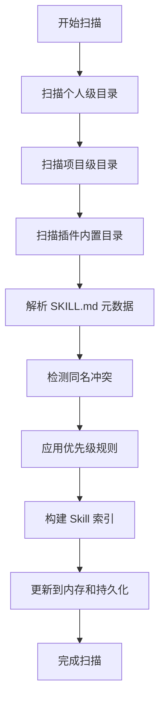

# Skill 目录结构和扫描规则

## 概述

CodeFlicker 通过扫描特定目录来发现和注册 skill。了解这些目录的位置和扫描规则对于正确管理 skill 非常重要。

## 默认扫描目录

### 项目级目录

CodeFlicker 会扫描当前项目根目录下的以下位置：

```
{project-root}/.kwaipilot/skills/
{project-root}/.opencode/skills/
{project-root}/.claude/skills/
```

**说明**：
- `{project-root}` 是当前项目的根目录
- 系统会自动识别 Git 工作树的根目录
- 如果不是 Git 项目，则使用当前打开的工作区根目录

### 个人级目录

CodeFlicker 会扫描用户主目录下的以下位置：

```
~/.kwaipilot/skills/
~/.opencode/skills/
~/.claude/skills/
```

**说明**：
- `~` 代表用户主目录
- 在 macOS/Linux 上是 `/Users/{username}` 或 `/home/{username}`
- 在 Windows 上是 `C:\Users\{username}`

### 插件内置目录

插件内置 skill 的位置：

```
{extension-path}/.kwaipilot/internal/skills/
```

**说明**：
- 这是 VSCode 扩展的安装目录
- 用户通常不需要直接访问这个目录
- 插件更新时会自动更新内置 skill

## 目录优先级

当存在同名 skill 时，按以下优先级决定最终生效的版本：

```
Personal > Project > Plugin
1. 个人级目录
2. 项目级目录
3. 插件内置目录
```

### 示例

如果同时存在：
- `~/.kwaipilot/skills/code-review/`
- `.kwaipilot/skills/code-review/`
- 插件内置的 `code-review`

最终生效的是个人级目录中的 `code-review`。

## Skill 目录结构

### 最小结构

一个有效的 skill 至少需要：

```
skill-name/
└── SKILL.md          # 必需：入口文件
```

### 推荐结构

完整的 skill 目录结构：

```
skill-name/
├── SKILL.md              # 必需：入口文件
├── references/           # 可选：详细参考文档
│   ├── guide.md
│   └── api-docs.md
├── examples/             # 可选：示例代码
│   ├── example1.py
│   └── example2.js
└── scripts/              # 可选：工具脚本
    ├── setup.sh
    └── validate.sh
```

### 目录说明

#### SKILL.md（必需）

- skill 的入口文件
- 包含 YAML frontmatter 元数据
- 包含核心使用指南
- 保持精简（1500-2000字为宜）

#### references/（可选）

- 存放详细的参考文档
- 用于 Progressive Disclosure
- AI 按需加载详细内容
- 可以包含多个 Markdown 文件

#### examples/（可选）

- 存放可运行的示例代码
- 提供完整的使用示例
- 用户可以直接复制使用

#### scripts/（可选）

- 存放工具脚本
- 自动化常见操作
- 确保脚本有执行权限（`chmod +x`）

## 扫描规则

### 扫描触发时机

CodeFlicker 在以下时机扫描 skill 目录：

1. **扩展启动时**
   - VSCode 扩展加载时自动扫描
   - 构建初始 skill 索引

2. **定时扫描**（热重载）
   - 默认每 30 秒扫描一次
   - 检测新增、修改、删除的 skill
   - 自动更新 skill 索引

3. **手动刷新**（可选）
   - 用户可以手动触发刷新
   - 立即重新扫描所有目录

### 扫描过程



### 元数据解析

扫描时会解析 SKILL.md 的 YAML frontmatter：

```yaml
---
name: skill-name          # 必需
description: ...          # 必需
version: 1.0.0           # 可选
---
```

**必需字段**：
- `name`：skill 的唯一标识
- `description`：skill 的描述和触发场景

**可选字段**：
- `version`：skill 的版本号

### 验证规则

扫描时会验证：

1. ✅ `SKILL.md` 文件存在
2. ✅ YAML frontmatter 格式正确
3. ✅ `name` 字段存在且非空
4. ✅ `description` 字段存在且非空
5. ✅ YAML 分隔符（`---`）正确

**如果验证失败**：
- skill 不会被加入索引
- 会记录错误日志
- 不影响其他 skill 的加载

## 热重载机制

### 什么是热重载

热重载允许在不重启 VSCode 的情况下，自动检测和加载新的或修改的 skill。

### 工作原理

1. **定时扫描**
   - 每 30 秒扫描一次目录
   - 比较文件修改时间

2. **检测变更**
   - 新增的 skill 目录
   - 修改的 SKILL.md 文件
   - 删除的 skill 目录

3. **更新索引**
   - 重新解析元数据
   - 更新内存缓存
   - 持久化到 WorkspaceState

### 热重载的限制

- ✅ 检测 SKILL.md 元数据变更
- ✅ 检测新增/删除 skill
- ❌ 不自动重新加载已加载的完整内容
- ❌ 支持文件变更不会触发重新加载

**注意**：
- 元数据更新会立即生效
- 完整内容会在下次使用时重新加载

## 特殊情况处理

### 空目录

如果扫描到的目录为空（没有 skill）：
- 不会报错
- skill 列表为空
- 正常显示"无可用 skill"

### 权限问题

如果目录无读取权限：
- 记录错误日志
- 跳过该目录
- 继续扫描其他目录

### 损坏的 SKILL.md

如果 SKILL.md 格式错误：
- 该 skill 不加入索引
- 记录详细错误信息
- 提供文件路径和错误原因

### 同名 skill

如果多个来源有同名 skill：
- 按优先级选择生效版本
- 被覆盖的版本标记为 `overridden`
- 在 skill 列表中显示冲突提示

## 目录配置

### 可配置性

skill 目录列表是可配置的：

```json
{
  "kwaipilot.skills.projectDirs": [
    ".kwaipilot/skills",
    ".opencode/skills",
    ".claude/skills"
  ],
  "kwaipilot.skills.personalDirs": [
    "~/.kwaipilot/skills",
    "~/.opencode/skills",
    "~/.claude/skills"
  ]
}
```

**注意**：
- 配置由系统管理，通常无需手动修改
- 配置更新后会触发重新扫描

### 添加自定义目录

虽然不推荐，但可以通过配置添加自定义目录：

```bash
# 在 VSCode 设置中添加
"kwaipilot.skills.projectDirs": [
  ".kwaipilot/skills",
  "custom/skill/path"  # 自定义路径
]
```

## 最佳实践

### 目录组织

1. **项目级 skill 集中管理**
   ```
   .kwaipilot/skills/
   ├── code-review/
   ├── deployment/
   └── testing/
   ```

2. **个人级 skill 分类组织**
   ```
   ~/.kwaipilot/skills/
   ├── git/
   ├── refactoring/
   └── api-design/
   ```

3. **避免深层嵌套**
   - skill 目录应该在扫描目录的直接子目录
   - 不要创建多层嵌套结构

### 命名规范

1. **使用 kebab-case**
   - ✅ `code-review`
   - ✅ `api-testing`
   - ❌ `CodeReview`
   - ❌ `api_testing`

2. **避免特殊字符**
   - 仅使用小写字母、数字、连字符
   - 不使用空格、下划线、大写字母

3. **保持简洁**
   - 名称应该简短且描述性
   - 避免过长的名称

### 维护建议

1. **定期清理**
   - 删除不再使用的 skill
   - 更新过时的文档

2. **版本管理**
   - 项目级 skill 随项目 Git 管理
   - 个人级 skill 建议单独 Git 管理

3. **备份重要 skill**
   - 定期备份个人级 skill
   - 考虑云存储或 Git 仓库

## 故障排查

### Skill 未被发现

**检查清单**：
1. ✅ 确认 skill 目录在扫描路径中
2. ✅ 确认 `SKILL.md` 文件存在
3. ✅ 确认 YAML frontmatter 格式正确
4. ✅ 确认 name 和 description 字段存在
5. ✅ 检查文件权限

**调试方法**：
```bash
# 检查文件是否存在
ls -la .kwaipilot/skills/skill-name/SKILL.md

# 检查 YAML 格式
head -n 10 .kwaipilot/skills/skill-name/SKILL.md

# 检查权限
ls -la .kwaipilot/skills/skill-name/
```

### Skill 冲突

**现象**：
- 多个来源有同名 skill
- 实际使用的不是期望的版本

**解决方法**：
1. 查看 skill 列表，确认优先级
2. 删除或重命名不需要的版本
3. 如果想使用低优先级版本，复制到高优先级目录

### 热重载不工作

**可能原因**：
- 定时扫描未启用
- 文件系统通知失效
- VSCode 扩展未正常运行

**解决方法**：
1. 重启 VSCode
2. 手动触发刷新
3. 检查扩展日志

## 总结

理解 skill 目录结构和扫描规则是有效管理 skill 的基础：

- **默认目录**：`.kwaipilot/skills/`（项目级）和 `~/.kwaipilot/skills/`（个人级）
- **优先级**：Personal > Project > Plugin
- **热重载**：自动检测变更，无需重启
- **验证规则**：确保 SKILL.md 格式正确
- **最佳实践**：合理组织、规范命名、定期维护
