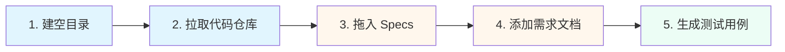

# QA Test 插件

> 最后更新：2026-01-17 11:30

本插件提供测试用例生成相关的 Skills。

## 包含的 Skills

| Skill | 功能 |
|-------|------|
| [test-case-generate](./skills/test-case-generate/) | 生成 KDEV 测试用例以及手工测试用例 |

## 使用方式

### test-case-generate

#### 前置条件

在使用 Skill 之前，需要准备以下外部资产：

```
📋 产品需求文档 (PRD)     →  了解业务需求和功能范围
📐 交互设计文档            →  了解交互流程和状态变化
🎨 设计稿                 →  了解 UI 元素和视觉效果
⚙️  技术设计文档           →  了解技术实现细节
```

结合这些资产，使用该 Skill 即可生成对应的手工测试用例。

---

#### 在 Codex/Claude 中使用

将 Skill 安装到 Agent 系统中，当用户触发相关请求时自动加载。

**触发条件**：用户说"生成测试用例"、"写 QA 用例"、"写测试用例"、"generate test cases"、或提供交互设计文档要求生成测试时触发。

##### 📖 推荐用法示例

测试智能体相关功能时：



**操作步骤**：

1. 📁 建一个空目录
2. 📦 拉取相关代码仓库（如 `ide-agent`、`kwaipilot-vscode-extension`）
3. 📄 把仓库里对应的 Specs 拖入输入框
4. 📝 把对应的需求文档复制到本地，加入到上下文
5. ✨ 输入指令让 Agent 生成手工用例

---

#### 手动参考

直接阅读 `skills/test-case-generate/SKILL.md` 了解测试用例生成的方法论。

##### 工作流程

```
┌─────────────────────────────────────────────────────────┐
│  Step 1: 分析文档                                        │
│  ├─ 识别测试区域/组件                                    │
│  ├─ 建议分组框架                                         │
│  └─ 确认格式偏好                                         │
└────────────────┬────────────────────────────────────────┘
                 │
                 ▼
┌─────────────────────────────────────────────────────────┐
│  Step 2: 用户确认                                        │
│  └─ 讨论调整框架                                         │
└────────────────┬────────────────────────────────────────┘
                 │
                 ▼
┌─────────────────────────────────────────────────────────┐
│  Step 3: 生成用例                                        │
│  ├─ 场景梳理（端到端流程）                               │
│  └─ 功能点测试（细粒度覆盖）                             │
└─────────────────────────────────────────────────────────┘
```
