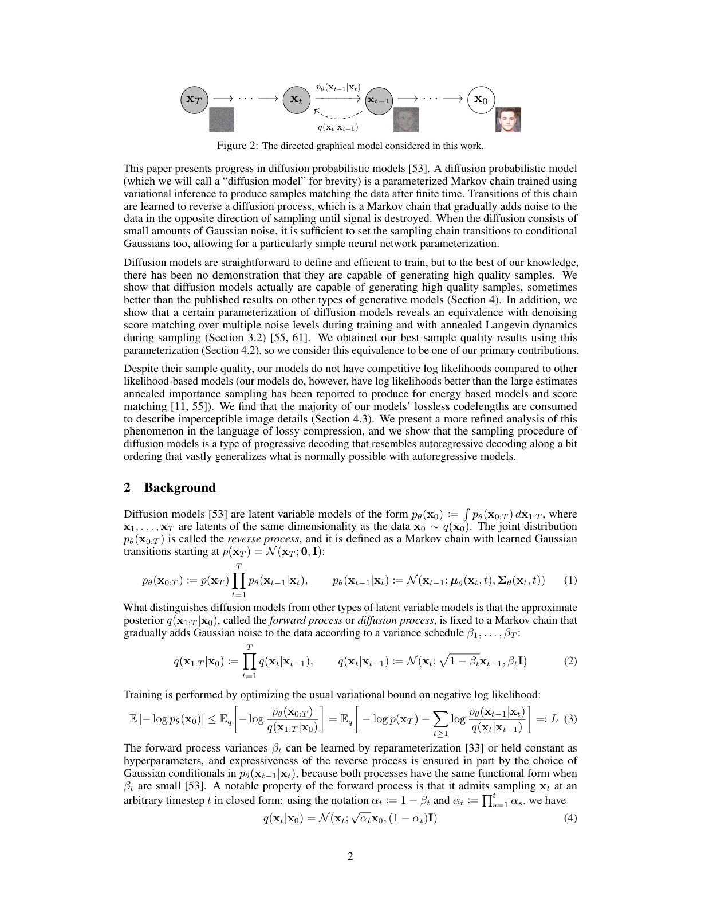
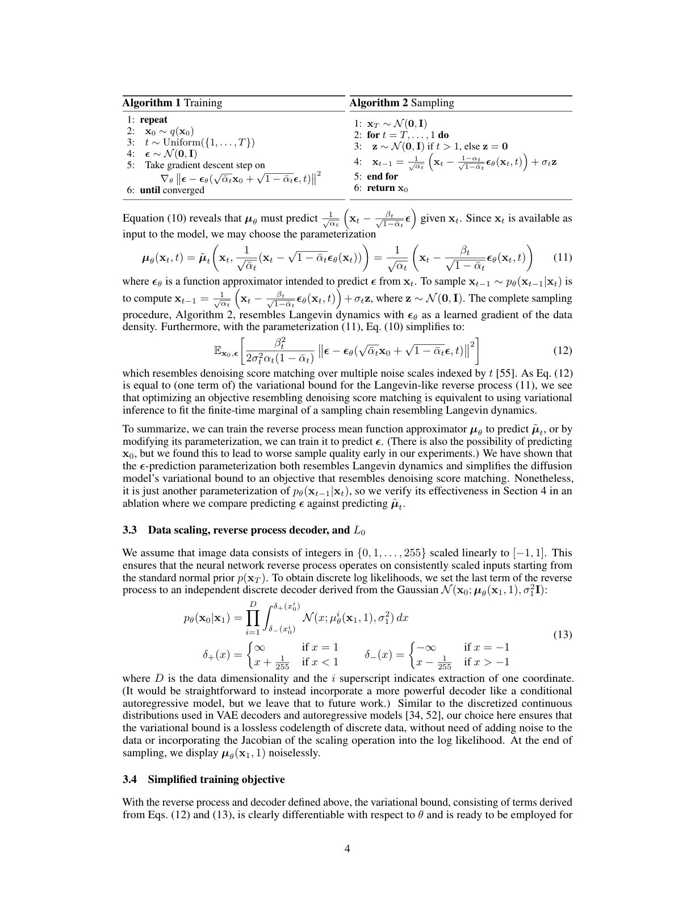
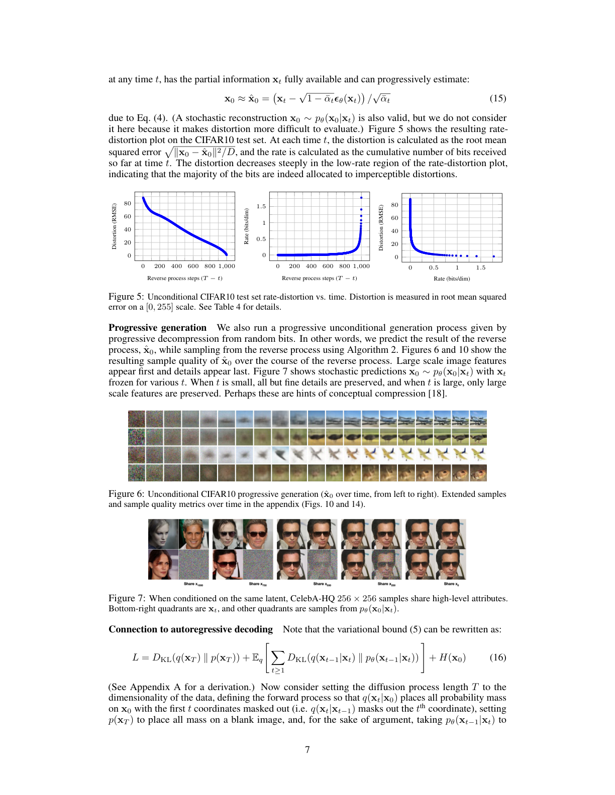
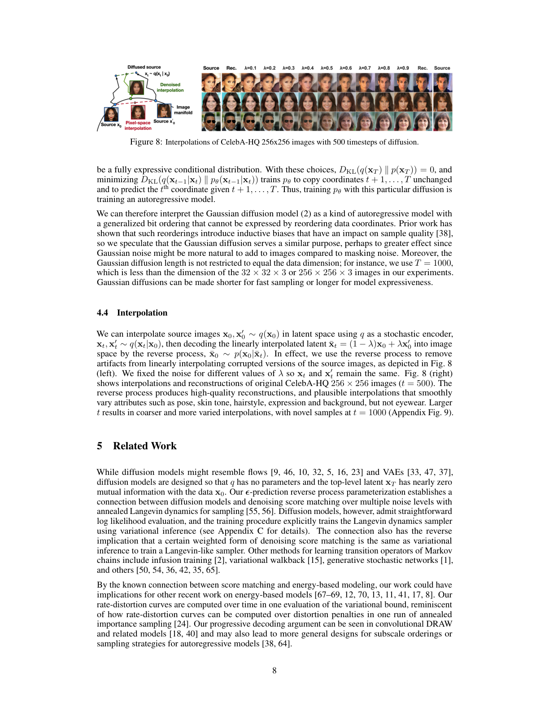
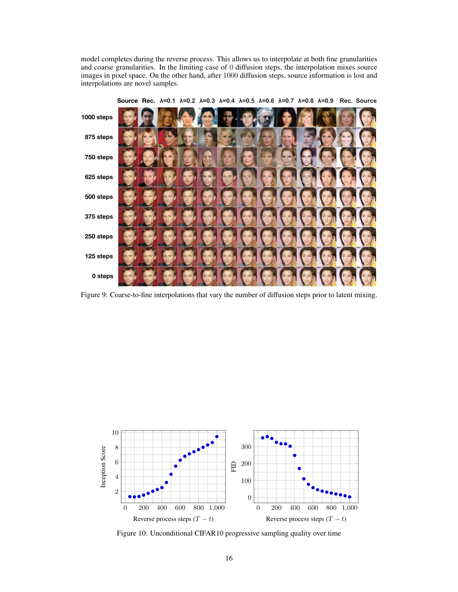

# 去噪扩散概率模型

> 原文：Denoising Diffusion Probabilistic Models
> 作者：Jonathan Ho, Ajay Jain, Pieter Abbeel（UC Berkeley）
> 发表：NeurIPS 2020（arXiv:2006.11239）
> 说明：本文档为全文中译。公式、图表编号与原文一致；图见对应页截图 `figures/page_N.png`，[英文原文 PDF](ddpm.pdf)，[官方代码](https://github.com/hojonathanho/diffusion)。

---

## 摘要

我们使用扩散概率模型（一类受非平衡热力学启发的潜变量模型）给出了高质量的图像合成结果。我们最好的结果是通过在一种加权变分下界上训练得到的，该下界根据扩散概率模型与带 Langevin 动力学的去噪得分匹配之间的一种新联系而设计；我们的模型还天然具有一种渐进式有损解压缩方案，可解释为自回归解码的推广。在无条件的 CIFAR-10 数据集上，我们取得 9.46 的 Inception 分数和 3.17 的最先进 FID 分数。在 256×256 的 LSUN 上，我们的样本质量与 ProgressiveGAN 相近。实现见 https://github.com/hojonathanho/diffusion。


> **图 1.** 在 CelebA-HQ 256×256（左）和无条件 CIFAR-10（右）上生成的样本。

---

## 1. 引言

各种类型的深度生成模型最近在广泛的数据模态上都展现出高质量样本。生成对抗网络（GAN）、自回归模型、流（flows）和变分自编码器（VAE）已合成了引人注目的图像和音频样本 [14, 27, 3, 58, 38, 25, 10, 32, 44, 57, 26, 33, 45]，基于能量的建模和得分匹配也取得了显著进展，产生了可与 GAN 相比的图像 [11, 55]。



> **图 2.** 本工作考虑的有向图模型。

本文介绍了扩散概率模型 [53] 的进展。扩散概率模型（为简洁起见我们称之为"扩散模型"）是一个参数化的马尔可夫链，用变分推断训练，以在有限时间后产生与数据匹配的样本。这条链的转移被学习用来逆转一个扩散过程——扩散过程是一个马尔可夫链，它在采样的反方向上逐步向数据添加噪声，直到信号被破坏。当扩散由少量高斯噪声组成时，将采样链的转移也设为条件高斯就足够了，这允许一种特别简单的神经网络参数化。

扩散模型定义直接、训练高效，但据我们所知，此前尚未证明它们能生成高质量样本。我们表明扩散模型实际上能生成高质量样本，有时优于其他类型生成模型上的已发表结果（第 4 节）。此外，我们表明扩散模型的某种参数化揭示了训练时与多噪声级别去噪得分匹配、采样时与退火 Langevin 动力学的等价性（第 3.2 节）[55, 61]。我们用这种参数化获得了最佳样本质量结果（第 4.2 节），因此我们认为这种等价性是我们的主要贡献之一。

尽管样本质量高，但与其他基于似然的模型相比，我们的模型没有有竞争力的对数似然（不过，我们的模型的对数似然确实优于退火重要性采样被报告为基于能量的模型和得分匹配所产生的大估计值 [11, 55]）。我们发现我们模型的无损码长大部分被用来描述不可察觉的图像细节（第 4.3 节）。我们用有损压缩的语言对这一现象给出更精细的分析，并表明扩散模型的采样过程是一种渐进式解码，类似沿比特顺序的自回归解码，且极大推广了自回归模型通常所能做到的。

---

## 2. 背景

扩散模型 [53] 是如下形式的潜变量模型：p_θ(x₀) := ∫ p_θ(x_{0:T}) dx_{1:T}，其中 x₁, ..., x_T 是与数据 x₀ ~ q(x₀) 同维度的潜变量。联合分布 p_θ(x_{0:T}) 称为**反向过程**，定义为从 p(x_T) = N(x_T; 0, I) 出发、带学习到的条件高斯转移的马尔可夫链：

```
p_θ(x_{0:T}) := p(x_T) ∏_{t=1}^{T} p_θ(x_{t−1}|x_t),
p_θ(x_{t−1}|x_t) := N(x_{t−1}; μ_θ(x_t, t), Σ_θ(x_t, t))        (1)
```

扩散模型与其他潜变量模型的区别在于：近似后验 q(x_{1:T}|x₀)，称为**前向过程**或**扩散过程**，被固定为一个按方差调度 β₁, ..., β_T 逐步向数据添加高斯噪声的马尔可夫链：

```
q(x_{1:T}|x₀) := ∏_{t=1}^{T} q(x_t|x_{t−1}),
q(x_t|x_{t−1}) := N(x_t; √(1−β_t) x_{t−1}, β_t I)             (2)
```

训练通过优化负对数似然的常规变分下界进行：

```
E[−log p_θ(x₀)] ≤ E_q[ −log p_θ(x_{0:T}) / q(x_{1:T}|x₀) ]
              = E_q[ −log p(x_T) − Σ_{t≥1} log p_θ(x_{t−1}|x_t) / q(x_t|x_{t−1}) ]
              =: L        (3)
```

前向过程方差 β_t 可通过重参数化 [33] 学习，或作为超参数保持恒定。反向过程的表达能力部分由 p_θ(x_{t−1}|x_t) 中条件高斯的选择保证，因为当 β_t 很小时，两个过程有相同的函数形式 [53]。前向过程的一个显著性质是它允许在任意时间步 t 以闭式采样 x_t：用记号 α_t := 1 − β_t 和 ᾱ_t := ∏_{s=1}^{t} α_s，我们有

```
q(x_t|x₀) = N(x_t; √ᾱ_t · x₀, (1 − ᾱ_t) I)                  (4)
```

因此，通过用随机梯度下降优化 L 的随机项，可以实现高效训练。通过将 L（式 3）改写为下式，可进一步降低方差：

```
E_q[ D_KL(q(x_T|x₀) ‖ p(x_T))                 ← L_T
     + Σ_{t>1} D_KL(q(x_{t−1}|x_t, x₀) ‖ p_θ(x_{t−1}|x_t))  ← L_{t−1}
     − log p_θ(x₀|x₁) ]                          ← L_0        (5)
```

（细节见附录 A。各项的标签在第 3 节中使用。）式 (5) 用 KL 散度将 p_θ(x_{t−1}|x_t) 直接与前向过程后验比较，后者在条件于 x₀ 时是可处理的：

```
q(x_{t−1}|x_t, x₀) = N(x_{t−1}; μ̃_t(x_t, x₀), β̃_t I)        (6)

其中
μ̃_t(x_t, x₀) := [√ᾱ_{t−1} β_t / (1−ᾱ_t)] · x₀
              + [√α_t (1−ᾱ_{t−1}) / (1−ᾱ_t)] · x_t
以及
β̃_t := [(1−ᾱ_{t−1}) / (1−ᾱ_t)] · β_t                          (7)
```

因此，式 (5) 中所有 KL 散度都是高斯之间的比较，所以它们可以用 Rao-Blackwell 化方式以闭式表达式计算，而非高方差的蒙特卡洛估计。

---

## 3. 扩散模型与去噪自编码器

扩散模型看似是潜变量模型的一个受限类别，但它们在实现上允许大量自由度。必须选择前向过程的方差 β_t、模型架构以及反向过程的高斯分布参数化。为引导我们的选择，我们在扩散模型与去噪得分匹配之间建立了一个新的显式联系（第 3.2 节），由此得到扩散模型的一个简化的、加权的变分下界目标（第 3.4 节）。最终，我们的模型设计由简洁性和实证结果（第 4 节）证明其合理性。我们的讨论按式 (5) 的各项分类。

### 3.1 前向过程与 L_T

我们忽略前向过程方差 β_t 可通过重参数化学习这一事实，而将它们固定为常数（详见第 4 节）。因此，在我们的实现中，近似后验 q 没有可学习参数，所以 L_T 在训练期间是常数，可以忽略。

### 3.2 反向过程与 L_{1:T−1}

现在我们讨论对 1 < t ≤ T，在 p_θ(x_{t−1}|x_t) = N(x_{t−1}; μ_θ(x_t, t), Σ_θ(x_t, t)) 中的选择。首先，我们设 Σ_θ(x_t, t) = σ_t² I 为未经训练的、依赖时间的常数。实验上，σ_t² = β_t 和 σ_t² = β̃_t = [(1−ᾱ_{t−1})/(1−ᾱ_t)]·β_t 结果相近。第一种选择对 x₀ ~ N(0, I) 最优，第二种选择对 x₀ 被确定性设为单点最优。这两个极端选择对应于坐标单位方差数据的反向过程熵的上下界 [53]。

其次，为表示均值 μ_θ(x_t, t)，我们提出一种特定参数化，它由以下对 L_t 的分析所启发。当 p_θ(x_{t−1}|x_t) = N(x_{t−1}; μ_θ(x_t, t), σ_t² I) 时，我们可以写出：

```
L_{t−1} = E_q[ (1 / 2σ_t²) ‖μ̃_t(x_t, x₀) − μ_θ(x_t, t)‖² ] + C    (8)
```

其中 C 是不依赖 θ 的常数。所以我们看到，μ_θ 最直接的参数化是一个预测 μ̃_t（前向过程后验均值）的模型。然而，我们可以通过将式 (4) 重参数化为 x_t(x₀, ε) = √ᾱ_t·x₀ + √(1−ᾱ_t)·ε（ε ~ N(0, I)），并应用前向过程后验公式 (7)，进一步展开式 (8)：

```
L_{t−1} − C = E_{x₀,ε}[ (1/2σ_t²) ‖ μ̃_t(x_t(x₀,ε), (x_t(x₀,ε) − √(1−ᾱ_t)ε)/√ᾱ_t) − μ_θ(x_t(x₀,ε), t) ‖² ]   (9)

            = E_{x₀,ε}[ (1/2σ_t²) ‖ (1/√α_t)(x_t(x₀,ε) − [β_t/√(1−ᾱ_t)] ε) − μ_θ(x_t(x₀,ε), t) ‖² ]        (10)
```

式 (10) 揭示，给定 x_t，μ_θ 必须预测 (1/√α_t)(x_t − [β_t/√(1−ᾱ_t)] ε)。由于 x_t 可作为模型输入，我们可以选择参数化

```
μ_θ(x_t, t) = μ̃_t(x_t, (x_t − √(1−ᾱ_t)·ε_θ(x_t)) / √ᾱ_t)
            = (1/√α_t)(x_t − [β_t/√(1−ᾱ_t)] ε_θ(x_t, t))      (11)
```

其中 ε_θ 是一个函数逼近器，旨在从 x_t 预测 ε。要采样 x_{t−1} ~ p_θ(x_{t−1}|x_t)，就是计算 x_{t−1} = (1/√α_t)(x_t − [β_t/√(1−ᾱ_t)] ε_θ(x_t, t)) + σ_t·z，其中 z ~ N(0, I)。完整的采样过程（算法 2）类似 Langevin 动力学，其中 ε_θ 作为数据密度的学习梯度。此外，用参数化 (11)，式 (10) 简化为：

```
E_{x₀,ε}[ (β_t² / 2σ_t² α_t (1−ᾱ_t)) ‖ε − ε_θ(√ᾱ_t x₀ + √(1−ᾱ_t) ε, t)‖² ]   (12)
```

这类似在由 t 索引的多个噪声尺度上的去噪得分匹配 [55]。由于式 (12) 等于（类似 Langevin 的）反向过程 (11) 的变分下界的一项，我们看到优化类似去噪得分匹配的目标，等价于用变分推断拟合类似 Langevin 动力学的采样链的有限时间边缘分布。

总之，我们可以训练反向过程均值函数逼近器 μ_θ 来预测 μ̃_t，或者通过修改其参数化，训练它来预测 ε。（也存在预测 x₀ 的可能，但我们在早期实验中发现这导致更差的样本质量。）我们已经表明，ε-预测参数化既类似 Langevin 动力学，又将扩散模型的变分下界简化为类似去噪得分匹配的目标。尽管如此，(11) 只是 p_θ(x_{t−1}|x_t) 的另一种参数化，所以我们在第 4 节的一个消融中验证其有效性，其中我们比较预测 ε 与预测 μ̃_t。

```
算法 1 训练                          算法 2 采样
─────────────────────────────        ─────────────────────────────────
1: repeat                            1: x_T ~ N(0, I)
2:   x₀ ~ q(x₀)                      2: for t = T, ..., 1 do
3:   t ~ Uniform({1,...,T})          3:   z ~ N(0, I)  若 t>1，否则 z=0
4:   ε ~ N(0, I)                     4:   x_{t−1} = (1/√α_t)(x_t −
5:   对下式做梯度下降步:                     [(1−α_t)/√(1−ᾱ_t)] ε_θ(x_t,t)) + σ_t z
     ∇_θ ‖ε − ε_θ(√ᾱ_t x₀           5: end for
        + √(1−ᾱ_t) ε, t)‖²         6: return x₀
6: until 收敛
```



> **算法 1（训练）与算法 2（采样）** 原文截图。

### 3.3 数据缩放、反向过程解码器与 L₀

我们假设图像数据由 {0, 1, ..., 255} 中的整数线性缩放到 [−1, 1]。这确保神经网络反向过程从标准正态先验 p(x_T) 开始，在一致缩放的输入上运行。为获得离散对数似然，我们将反向过程的最后一项设为独立离散解码器，它由高斯 N(x₀; μ_θ(x₁, 1), σ₁²I) 导出：

```
p_θ(x₀|x₁) = ∏_{i=1}^{D} ∫_{δ−(x₀^i)}^{δ+(x₀^i)} N(x; μ_θ^i(x₁,1), σ₁²) dx

δ+(x) = { ∞        若 x = 1        δ−(x) = { −∞      若 x = −1
        { x + 1/255 若 x < 1                { x − 1/255 若 x > −1    (13)
```

其中 D 是数据维度，上标 i 表示提取一个坐标。（要换成更强的解码器如条件自回归模型是直接的，但我们留待未来工作。）与 VAE 解码器和自回归模型中使用的离散化连续分布 [34, 52] 类似，我们这里的选择确保变分下界是离散数据的无损码长，无需向数据加噪声，也无需将缩放操作的雅可比并入对数似然。采样结束时，我们无噪声地显示 μ_θ(x₁, 1)。

### 3.4 简化的训练目标

按上面定义的反向过程和解码器，由式 (12) 和 (13) 导出的各项组成的变分下界显然对 θ 可微，已可用于训练。然而，我们发现在以下变分下界的变体上训练对样本质量有益（且实现更简单）：

```
L_simple(θ) := E_{t,x₀,ε}[ ‖ε − ε_θ(√ᾱ_t x₀ + √(1−ᾱ_t) ε, t)‖² ]     (14)
```

其中 t 在 1 和 T 之间均匀分布。t = 1 的情形对应于 L₀，其中离散解码器定义 (13) 中的积分由高斯概率密度函数乘以 bin 宽度近似，忽略 σ₁² 和边缘效应。t > 1 的情形对应式 (12) 的未加权版本，类似于 NCSN 去噪得分匹配模型 [55] 所用的损失加权。（L_T 不出现，因为前向过程方差 β_t 固定。）算法 1 展示了带此简化目标的完整训练过程。

由于我们的简化目标 (14) 丢弃了式 (12) 中的加权，它是一个加权变分下界，相比标准变分下界 [18, 22] 强调重建的不同方面。特别地，我们在第 4 节的扩散过程设置使简化目标对小 t 对应的损失项降权。这些项训练网络对噪声量很小的数据去噪，因此对它们降权是有益的，使网络能专注于更大 t 项的更困难去噪任务。我们将在实验中看到这种重新加权带来更好的样本质量。

---

## 4. 实验

我们为所有实验设 T = 1000，使采样期间所需的神经网络评估次数与先前工作 [53, 55] 一致。我们将前向过程方差设为从 β₁ = 10⁻⁴ 线性增加到 β_T = 0.02 的常数。这些常数被选为相对缩放到 [−1, 1] 的数据而言很小，确保反向和前向过程有近似相同的函数形式，同时使 x_T 处的信噪比尽可能小（在我们的实验中 L_T = D_KL(q(x_T|x₀) ‖ N(0, I)) ≈ 10⁻⁵ 比特/维）。

为表示反向过程，我们使用类似未掩码 PixelCNN++ [52, 48] 的 U-Net 骨干，全程用组归一化 [66]。参数跨时间共享，时间用 Transformer 正弦位置嵌入 [60] 指定给网络。我们在 16×16 特征图分辨率使用自注意力 [63, 60]。细节见附录 B。

### 4.1 样本质量

表 1 显示 CIFAR-10 上的 Inception 分数、FID 分数和负对数似然（无损码长）。用我们 3.17 的 FID 分数，我们的无条件模型取得了比文献中大多数模型（包括类条件模型）更好的样本质量。我们的 FID 分数按标准做法相对训练集计算；相对测试集计算时分数为 5.24，仍优于文献中许多训练集 FID 分数。

我们发现，如预期，在真实变分下界上训练我们的模型得到比在简化目标上训练更好的码长，但后者产生最佳样本质量。CIFAR-10 和 CelebA-HQ 256×256 样本见图 1，LSUN 256×256 样本见图 3 和图 4，更多见附录 D。

**表 1.** CIFAR-10 结果。NLL 以比特/维度量。
**表 2.** 无条件 CIFAR-10 反向过程参数化与训练目标消融。空白项训练不稳定，生成样本超出范围分数差。

### 4.2 反向过程参数化与训练目标消融

在表 2 中，我们展示反向过程参数化和训练目标（第 3.2 节）对样本质量的影响。我们发现，预测 μ̃ 的基线选项只有在真实变分下界上训练（而非未加权均方误差——类似式 (14) 的简化目标）时才有效。我们还看到，学习反向过程方差（通过将参数化对角 Σ_θ(x_t) 并入变分下界）相比固定方差会导致训练不稳定和更差的样本质量。按我们提出的预测 ε，在固定方差的变分下界上训练时与预测 μ̃ 大致相当，但在我们的简化目标上训练时好得多。

### 4.3 渐进式编码

表 1 还显示了我们 CIFAR-10 模型的码长。训练与测试之间的差距至多为 0.03 比特/维，与其他基于似然的模型报告的差距相当，表明我们的扩散模型没有过拟合（最近邻可视化见附录 D）。尽管如此，虽然我们的无损码长优于用退火重要性采样为基于能量的模型和得分匹配报告的大估计值 [11]，但它们不与其他类型的基于似然的生成模型 [7] 有竞争力。

尽管如此，由于我们的样本质量高，我们得出结论：扩散模型具有一种归纳偏置，使它们成为出色的有损压缩器。将变分下界各项 L₁ + ... + L_T 视为码率、L₀ 视为失真，我们样本质量最高的 CIFAR-10 模型码率为 1.78 比特/维、失真为 1.97 比特/维，相当于在 0 到 255 尺度上均方根误差 0.95。无损码长的一半以上用于描述不可察觉的失真。

**渐进有损压缩。** 我们可以通过引入一种镜像式 (5) 形式的渐进有损编码来进一步探究我们模型的率失真行为：见算法 3 和算法 4，它们假设可以访问一个过程（如最小随机编码 [19, 20]），能对任意分布 p 和 q，用平均约 D_KL(q(x) ‖ p(x)) 比特传输样本 x ~ q(x)，其中只有 p 事先对接收方可用。当应用于 x₀ ~ q(x₀) 时，算法 3 和 4 依次传输 x_T, ..., x₀，总期望码长等于式 (5)。

接收方在任意时刻 t 都拥有完整的部分信息 x_t，并可渐进地估计：

```
x₀ ≈ x̂₀ = (x_t − √(1−ᾱ_t) ε_θ(x_t)) / √ᾱ_t        (15)
```

这由式 (4) 得来。（随机重建 x₀ ~ p_θ(x₀|x_t) 也是有效的，但我们这里不考虑它，因为它使失真更难评估。）图 5 显示了 CIFAR-10 测试集上得到的率失真图。在每个时刻 t，失真计算为均方根误差 √(‖x₀ − x̂₀‖²/D)，码率计算为到时刻 t 为止累计接收的比特数。失真在率失真图的低码率区急剧下降，表明大部分比特确实分配给了不可察觉的失真。



> **图 5.** 无条件 CIFAR-10 测试集率失真随时间变化。失真以 [0,255] 尺度上的均方根误差衡量。
> **图 6.** 无条件 CIFAR-10 渐进生成（x̂₀ 随时间，从左到右）。
> **图 7.** 当条件于相同潜变量时，CelebA-HQ 256×256 样本共享高层属性。

**渐进生成。** 我们还运行由随机比特的渐进解压缩给出的渐进无条件生成过程。换句话说，在用算法 2 从反向过程采样时，我们预测反向过程的结果 x̂₀。图 6 和图 10 显示反向过程中 x̂₀ 的样本质量。大尺度图像特征首先出现，细节最后出现。图 7 显示在 x_t 固定时对不同 t 的随机预测 x₀ ~ p_θ(x₀|x_t)。t 小时除细节外都被保留，t 大时只有大尺度特征被保留。也许这些暗示了概念压缩 [18]。

**与自回归解码的联系。** 注意变分下界 (5) 可改写为：

```
L = D_KL(q(x_T) ‖ p(x_T)) + E_q[ Σ_{t≥1} D_KL(q(x_{t−1}|x_t) ‖ p_θ(x_{t−1}|x_t)) ] + H(x₀)   (16)
```

（推导见附录 A。）现在考虑将扩散过程长度 T 设为数据维度，定义前向过程使 q(x_t|x₀) 将所有概率质量放在 x₀ 的前 t 个坐标被掩码上（即 q(x_t|x_{t−1}) 掩码第 t 个坐标），设 p(x_T) 将所有质量放在一幅空白图像上，并且为论证起见，取 p_θ(x_{t−1}|x_t) 为完全表达能力的条件分布。用这些选择，D_KL(q(x_T) ‖ p(x_T)) = 0，最小化 D_KL(q(x_{t−1}|x_t) ‖ p_θ(x_{t−1}|x_t)) 训练 p_θ 原样复制坐标 t+1, ..., T，并在给定 t+1, ..., T 时预测第 t 个坐标。因此，用此特定扩散训练 p_θ 就是在训练一个自回归模型。

因此，我们可以将高斯扩散模型 (2) 解释为一种具有广义比特顺序的自回归模型，这种顺序无法通过重排数据坐标来表达。先前工作表明这种重排引入影响样本质量的归纳偏置 [38]，所以我们推测高斯扩散起到类似作用，也许效果更强，因为相比掩码噪声，高斯噪声对图像可能更自然。此外，高斯扩散长度不限于等于数据维度；例如我们用 T = 1000，它小于我们实验中 32×32×3 或 256×256×3 图像的维度。高斯扩散可以做得更短以快速采样，或更长以增强模型表达能力。

### 4.4 插值

我们可以在潜空间用 q 作为随机编码器对源图像 x₀, x'₀ ~ q(x₀) 进行插值，x_t, x'_t ~ q(x_t|x₀)，然后通过反向过程将线性插值的潜变量 x̄_t = (1−λ)x₀ + λx'₀ 解码到图像空间，x̄₀ ~ p(x₀|x̄_t)。实际上，我们用反向过程去除对源图像受损版本做线性插值产生的伪影，如图 8（左）所示。我们对不同 λ 值固定噪声，使 x_t 和 x'_t 保持相同。图 8（右）显示原始 CelebA-HQ 256×256 图像的插值和重建（t = 500）。反向过程产生高质量重建，以及平滑变化姿态、肤色、发型、表情和背景（但不含眼镜）等属性的合理插值。更大的 t 产生更粗糙、更多样的插值，t = 1000 时产生全新样本（附录图 9）。



> **图 8.** CelebA-HQ 256×256 图像用 500 个扩散时间步的插值。

---

## 5. 相关工作

虽然扩散模型可能类似流 [9, 46, 10, 32, 5, 16, 23] 和 VAE [33, 47, 37]，但扩散模型被设计为使 q 没有参数，且顶层潜变量 x_T 与数据 x₀ 的互信息几乎为零。我们的 ε-预测反向过程参数化建立了扩散模型与多噪声级别去噪得分匹配、采样用退火 Langevin 动力学之间的联系 [55, 56]。然而，扩散模型允许直接的对数似然评估，且训练过程显式地用变分推断训练 Langevin 动力学采样器（细节见附录 C）。这种联系还有一个反向含义：某种加权形式的去噪得分匹配等同于训练类似 Langevin 采样器的变分推断。其他学习马尔可夫链转移算子的方法包括 infusion training [2]、variational walkback [15]、生成随机网络 [1] 等 [50, 54, 36, 42, 35, 65]。

通过得分匹配与基于能量的建模之间已知的联系，我们的工作可能对其他近期基于能量的模型的工作 [67–69, 12, 70, 13, 11, 41, 17, 8] 有启示。我们的率失真曲线在一次变分下界评估中随时间计算，令人联想到率失真曲线可在一次退火重要性采样运行中随失真惩罚计算 [24]。我们的渐进解码论证可见于卷积 DRAW 及相关模型 [18, 40]，也可能为自回归模型 [38, 64] 的子尺度排序或采样策略带来更通用的设计。

---

## 6. 结论

我们用扩散模型给出了高质量图像样本，并发现了扩散模型与训练马尔可夫链的变分推断、去噪得分匹配和退火 Langevin 动力学（进而基于能量的模型）、自回归模型以及渐进有损压缩之间的联系。由于扩散模型对图像数据似乎有出色的归纳偏置，我们期待研究它们在其他数据模态中、以及作为其他类型生成模型和机器学习系统组件的用途。

---

## 更广泛的影响

我们在扩散模型上的工作与现有其他类型深度生成模型（如改进 GAN、流、自回归模型等样本质量）的工作范围类似。我们的论文代表了使扩散模型成为这一系列技术中通用工具的进展，因此它可能放大生成模型已经（并将继续）对更广阔世界产生的任何影响。

不幸的是，生成模型有许多众所周知的恶意用途。样本生成技术可被用来为政治目的制作高知名度人物的假图像和视频。虽然假图像在软件工具出现之前就早已由手工制作，但像我们这样的生成模型使这一过程更容易。幸运的是，CNN 生成的图像目前存在允许检测的细微缺陷 [62]，但生成模型的改进可能使这变得更困难。生成模型也反映其训练数据集中的偏见。由于许多大数据集由自动化系统从互联网收集，很难去除这些偏见，尤其当图像未标注时。如果在这些数据集上训练的生成模型的样本在互联网上泛滥，这些偏见只会被进一步强化。

另一方面，扩散模型可能对数据压缩有用，随着数据分辨率提高、全球互联网流量增加，这可能对确保互联网面向广大受众的可及性至关重要。我们的工作可能有助于在大量下游任务（从图像分类到强化学习）的无标注原始数据上的表示学习，扩散模型也可能在艺术、摄影和音乐创作中变得可行。

---

## 附录

### 附录 A：扩展推导

以下是式 (5)（扩散模型的降方差变分下界）的推导。该材料来自 Sohl-Dickstein 等 [53]；我们为完整起见收录于此。

```
L = E_q[−log p_θ(x_{0:T}) / q(x_{1:T}|x₀)]                        (17)
  = E_q[−log p(x_T) − Σ_{t≥1} log p_θ(x_{t−1}|x_t) / q(x_t|x_{t−1})]  (18)
  = E_q[−log p(x_T) − Σ_{t>1} log p_θ(x_{t−1}|x_t)/q(x_t|x_{t−1})
                          − log p_θ(x₀|x₁)/q(x₁|x₀)]              (19)
  = E_q[−log p(x_T) − Σ_{t>1} log [p_θ(x_{t−1}|x_t)/q(x_{t−1}|x_t,x₀)
                          · q(x_{t−1}|x₀)/q(x_t|x₀)]
                          − log p_θ(x₀|x₁)/q(x₁|x₀)]              (20)
  = E_q[−log p(x_T)/q(x_T|x₀)
        − Σ_{t>1} log p_θ(x_{t−1}|x_t)/q(x_{t−1}|x_t,x₀)
        − log p_θ(x₀|x₁)]                                          (21)
  = E_q[D_KL(q(x_T|x₀)‖p(x_T))
        + Σ_{t>1} D_KL(q(x_{t−1}|x_t,x₀)‖p_θ(x_{t−1}|x_t))
        − log p_θ(x₀|x₁)]                                          (22)
```

以下是 L 的另一种形式。它不易于估计，但对我们在 4.3 节的讨论有用。

```
L = E_q[−log p(x_T) − Σ_{t≥1} log p_θ(x_{t−1}|x_t)/q(x_t|x_{t−1})]      (23)
  = E_q[−log p(x_T) − Σ_{t≥1} log [p_θ(x_{t−1}|x_t)/q(x_{t−1}|x_t)
                          · q(x_{t−1})/q(x_t)]]                        (24)
  = E_q[−log p(x_T)/q(x_T) − Σ_{t≥1} log p_θ(x_{t−1}|x_t)/q(x_{t−1}|x_t)
                          − log q(x₀)]                                  (25)
  = D_KL(q(x_T)‖p(x_T)) + E_q[Σ_{t≥1} D_KL(q(x_{t−1}|x_t)‖p_θ(x_{t−1}|x_t))]
                          + H(x₀)                                       (26)
```

### 附录 B：实验细节

我们的神经网络架构遵循 PixelCNN++ [52] 的骨干，它是基于 Wide ResNet [72] 的 U-Net [48]。我们用组归一化 [66] 替换权重归一化 [49] 使实现更简单。我们的 32×32 模型用四个特征图分辨率（32×32 到 4×4），256×256 模型用六个。所有模型在每个分辨率级有两个卷积残差块，并在卷积块之间的 16×16 分辨率有自注意力块 [6]。扩散时间 t 通过将 Transformer 正弦位置嵌入 [60] 加入每个残差块来指定。我们的 CIFAR-10 模型有 3570 万参数，LSUN 和 CelebA-HQ 模型有 1.14 亿参数。我们还通过增加滤波器数量训练了一个约 2.56 亿参数的更大 LSUN Bedroom 变体。

我们为所有实验使用 TPU v3-8（类似 8 块 V100 GPU）。我们的 CIFAR 模型以 batch 128 每秒训练 21 步（800k 步训练完成需 10.6 小时），采样一批 256 张图像需 17 秒。我们的 CelebA-HQ/LSUN（256²）模型以 batch 64 每秒训练 2.2 步，采样一批 128 张图像需 300 秒。我们在 CelebA-HQ 上训练 0.5M 步，LSUN Bedroom 2.4M 步，LSUN Cat 1.8M 步，LSUN Church 1.2M 步。更大的 LSUN Bedroom 模型训练了 1.15M 步。

除了早期为使网络尺寸适配内存约束的初始超参数选择外，我们大部分超参数搜索是针对 CIFAR-10 样本质量优化的，然后将得到的设置迁移到其他数据集：

- 我们从常数、线性和二次调度中选择 β_t 调度，都约束为使 L_T ≈ 0。我们未经扫描设 T = 1000，并选择从 β₁ = 10⁻⁴ 到 β_T = 0.02 的线性调度。
- 我们在 {0.1, 0.2, 0.3, 0.4} 上扫描后将 CIFAR-10 的 dropout 率设为 0.1。CIFAR-10 上无 dropout 时，我们得到类似未正则化 PixelCNN++ [52] 中过拟合伪影的较差样本。我们将其他数据集的 dropout 率设为零（未扫描）。
- CIFAR-10 训练时我们用随机水平翻转；我们尝试了有翻转和无翻转两种训练，发现翻转略微改善样本质量。除 LSUN Bedroom 外，我们对所有其他数据集也使用随机水平翻转。
- 我们在实验早期尝试了 Adam [31] 和 RMSProp，选择了前者。我们将超参数保持为标准值。我们未经扫描将学习率设为 2×10⁻⁴，对 256×256 图像降为 2×10⁻⁵，因为更大学习率训练似乎不稳定。
- CIFAR-10 我们将 batch 大小设为 128，更大图像设为 64（未扫描）。
- 我们对模型参数用衰减因子 0.9999 的 EMA（未扫描）。

最终实验训练一次并在训练全程评估样本质量。样本质量分数和对数似然在训练过程中的最小 FID 值处报告。在 CIFAR-10 上，我们分别用 OpenAI [51] 和 TTUR [21] 仓库的原始代码在 50000 个样本上计算 Inception 和 FID 分数。在 LSUN 上，我们用 StyleGAN2 [30] 仓库的代码在 50000 个样本上计算 FID 分数。

### 附录 C：相关工作的讨论

我们的模型架构、前向过程定义和先验与 NCSN [55, 56] 在细微但重要的方面不同，这些方面改善了样本质量；值得注意的是，我们直接将采样器作为潜变量模型训练，而非事后附加。更详细地说：

1. 我们用带自注意力的 U-Net；NCSN 用带扩张卷积的 RefineNet。我们通过加入 Transformer 正弦位置嵌入使所有层都条件于 t，而非仅在归一化层（NCSNv1）或仅在输出（v2）。
2. 扩散模型在每个前向过程步骤缩小数据（乘以 √(1−β_t) 因子），使加噪声时方差不增长，从而为神经网络反向过程提供一致缩放的输入。NCSN 省略了这个缩放因子。
3. 与 NCSN 不同，我们的前向过程破坏信号（D_KL(q(x_T|x₀) ‖ N(0,I)) ≈ 0），确保 x_T 的先验与聚合后验紧密匹配。同样与 NCSN 不同，我们的 β_t 非常小，确保前向过程可被条件高斯马尔可夫链逆转。这两个因素都防止采样时的分布偏移。
4. 我们的类 Langevin 采样器的系数（学习率、噪声尺度等）严格由前向过程中的 β_t 导出。因此，我们的训练过程直接训练采样器在 T 步后匹配数据分布：它用变分推断将采样器作为潜变量模型训练。相比之下，NCSN 的采样器系数由事后手工设定，其训练过程不保证直接优化其采样器的质量指标。

### 附录 D：样本

**额外样本。** 图 11、13、16、17、18 和 19 显示在 CelebA-HQ、CIFAR-10 和 LSUN 数据集上训练的扩散模型的未经筛选的样本。

**潜结构与反向过程随机性。** 采样期间，先验 x_T ~ N(0, I) 和 Langevin 动力学都是随机的。为理解第二个噪声源的意义，我们对 CelebA 256×256 数据集条件于同一中间潜变量采样了多张图像。图 7 显示共享潜变量 x_t（t ∈ {1000, 750, 500, 250}）的来自反向过程 x₀ ~ p_θ(x₀|x_t) 的多次采样。为做到这一点，我们从先验的一次采样运行单条反向链。在中间时间步，链被分裂以采样多张图像。当链在 x_T=1000 的先验采样后分裂时，样本差异显著。然而，当链在更多步之后分裂时，样本共享性别、发色、眼镜、饱和度、姿态和面部表情等高层属性。这表明像 x₇₅₀ 这样的中间潜变量编码了这些属性，尽管它们不可察觉。

**由粗到精的插值。** 图 9 显示一对源 CelebA 256×256 图像之间的插值，我们在潜空间插值前改变扩散步数。增加扩散步数破坏源图像中更多结构，模型在反向过程中补全这些结构。这使我们能在细粒度和粗粒度上都进行插值。在 0 扩散步的极限情形，插值在像素空间混合源图像。另一方面，1000 扩散步后，源信息丢失，插值是全新样本。



> 附录的样本图（图 9–19）：CelebA-HQ / CIFAR-10 / LSUN 的生成样本、最近邻、渐进生成、插值等，见原文 PDF 第 15–25 页。

---

## 参考文献

（保留原文编号 [1]–[72]，均为英文文献，此处从略。完整列表见原文 PDF 第 9–12 页。）
