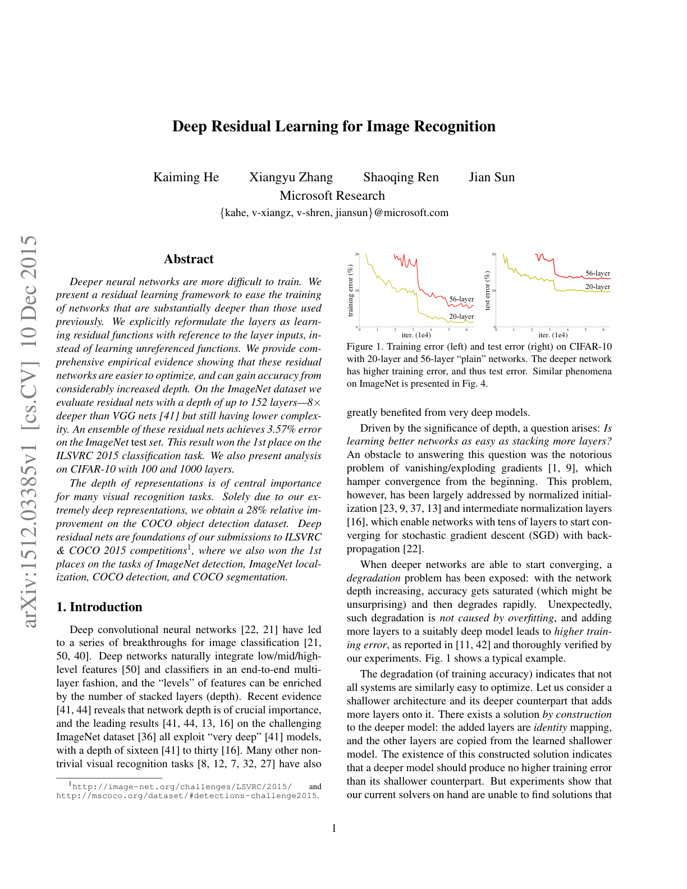
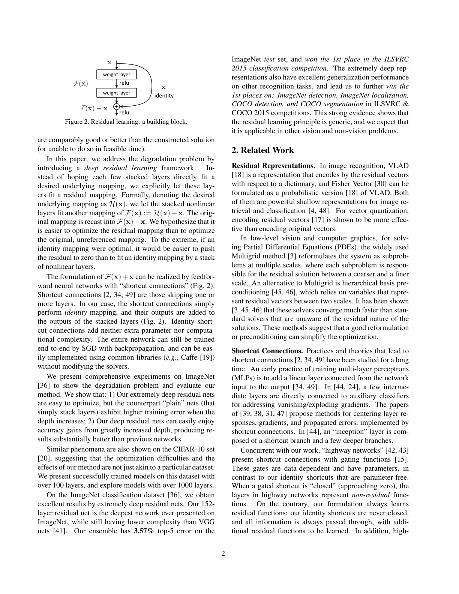
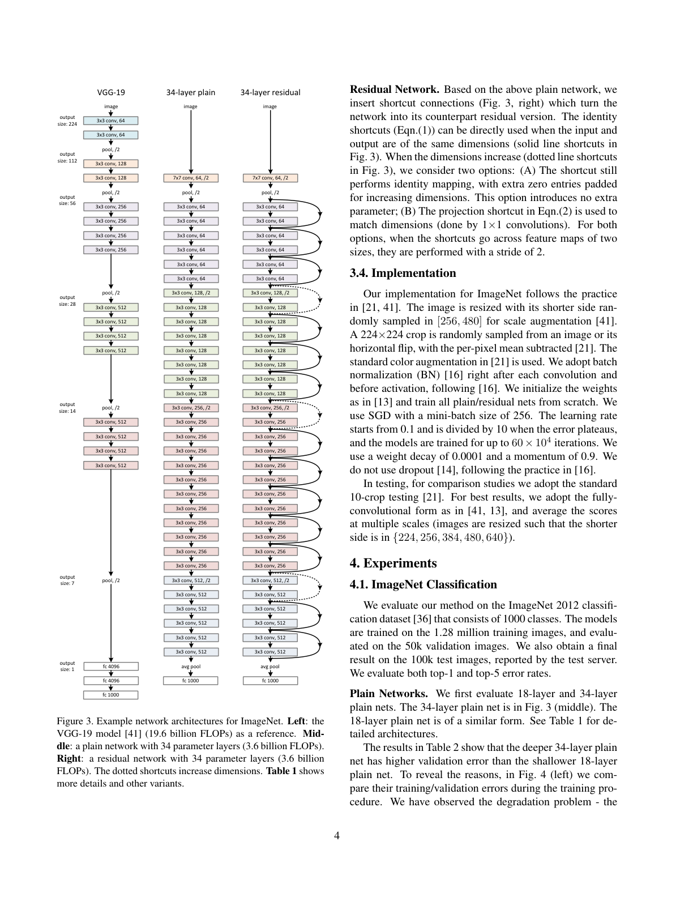
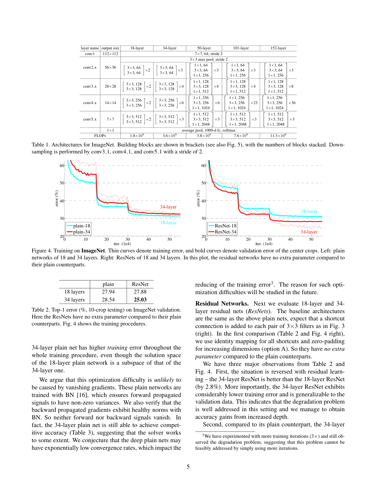
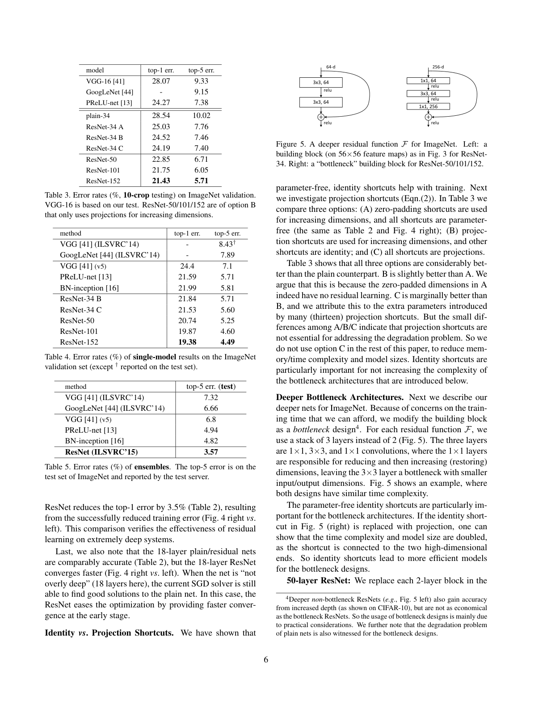
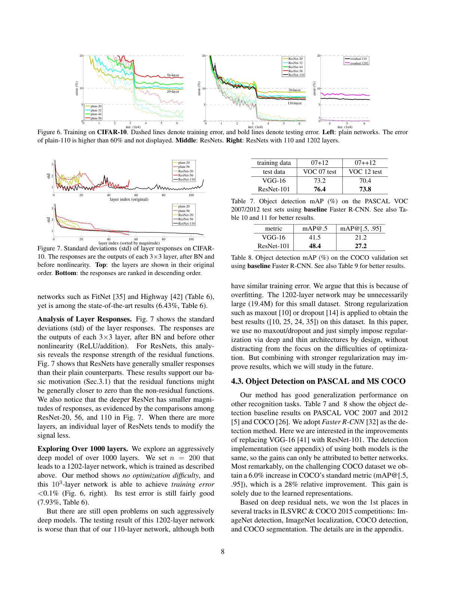

# 深度残差学习用于图像识别

> 原文：Deep Residual Learning for Image Recognition
> 作者：Kaiming He, Xiangyu Zhang, Shaoqing Ren, Jian Sun（Microsoft Research）
> 发表：CVPR 2016（arXiv:1512.03385）
> 说明：本文档为全文中译。公式、图表编号与原文一致；图见对应页截图 `figures/page_N.png`，[英文原文 PDF](resnet.pdf)。

---

## 摘要

更深的神经网络更难训练。我们提出一个残差学习框架，以便训练比以往所用网络深得多的网络。我们显式地将各层重新表述为"相对于层输入学习残差函数"，而不是学习无参照的原始函数。我们提供了充分的实证证据，表明这些残差网络更容易优化，并且能从大幅增加的深度中获得精度提升。在 ImageNet 数据集上，我们评估了最深达 152 层的残差网络——比 VGG 网络 [41] 深 8 倍，但复杂度更低。这些残差网络的集成在 ImageNet 测试集上取得了 3.57% 的错误率，赢得了 ILSVRC 2015 分类任务的第一名。我们还在 CIFAR-10 上对 100 层和 1000 层做了分析。

表示的深度对许多视觉识别任务至关重要。仅仅由于我们极深的表示，我们在 COCO 目标检测数据集上获得了 28% 的相对提升。深度残差网络是我们参加 ILSVRC & COCO 2015 竞赛¹ 的作品的基础，我们还在 ImageNet 检测、ImageNet 定位、COCO 检测和 COCO 分割任务上赢得了第一名。

> ¹ http://image-net.org/challenges/LSVRC/2015/ 和 http://mscoco.org/dataset/#detections-challenge2015

---

## 1. 引言

深度卷积神经网络 [22, 21] 为图像分类 [21, 50, 40] 带来了一系列突破。深度网络以端到端的多层方式自然地整合了低/中/高层特征 [50] 与分类器，特征的"层级"可以通过堆叠的层数（深度）来丰富。近期证据 [41, 44] 表明网络深度至关重要，在富有挑战性的 ImageNet 数据集 [36] 上的领先结果 [41, 44, 13, 16] 都利用了"非常深" [41] 的模型，深度从十六层 [41] 到三十层 [16] 不等。许多其他重要的视觉识别任务 [8, 12, 7, 32, 27] 也从非常深的模型中获益匪浅。



> **图 1.** 在 CIFAR-10 上，20 层与 56 层"plain"网络的训练误差（左）和测试误差（右）。更深的网络训练误差更高，测试误差也更高。ImageNet 上的类似现象见图 4。

由深度的重要性驱动，一个问题浮现出来：**学习更好的网络是否就像堆叠更多层一样容易？** 回答这个问题的一个障碍是臭名昭著的梯度消失/爆炸问题 [1, 9]，它从一开始就阻碍了收敛。然而，这个问题在很大程度上已被归一化初始化 [23, 9, 37, 13] 和中间归一化层 [16] 所解决，它们使得有数十层的网络能够通过带反向传播 [22] 的随机梯度下降（SGD）开始收敛。

<details class="deep-dive"><summary>📚 深度解析：梯度消失/爆炸问题及其解决（点击展开）</summary>

#### 问题本质

训练深层网络时，**误差信号在反向传播过程中会变得极小或极大**，导致网络无法正常学习。

**数学根源**：反向传播的链式法则要求梯度逐层连乘：

```
∂L/∂W₁ = ∂L/∂y · ∂y/∂h₁₀₀ · ∂h₉₉/∂h₉₈ · ... · ∂h₂/∂h₁ · ∂h₁/∂W₁
         └──────────────┬──────────────┘
                100 个导数连乘
```

- **梯度消失**：若每个导数 < 1（如 sigmoid 导数最大仅 0.25），则 `0.25¹⁰⁰ ≈ 10⁻⁶⁰`，浅层权重几乎不更新。
- **梯度爆炸**：若每个导数 > 1（如权重初始化过大），则 `1.5¹⁰⁰ ≈ 10¹⁷`，训练发散。

**类比**：传话游戏。100 人排队传话，每人听错 10%（乘 0.9），最后信息完全失真；或每人放大 10%（乘 1.1），最后变成噪音。

#### 解决方案 1：归一化初始化

**目标**：让每层输出的方差保持稳定，不随层数增加而爆炸或消失。

**Xavier 初始化**（论文引用的 [23, 9]）：

```
W ~ N(0, 1/n_in)
```

**He 初始化**（论文引用的 [13]，ResNet 作者自己提出，针对 ReLU 修正）：

```
W ~ N(0, 2/n_in)
```

**原理**：若输入 x 方差为 Var(x)，权重 W 方差为 Var(W)，则输出 y = Wx 的方差为：

```
Var(y) = n_in · Var(W) · Var(x)
```

为保持 Var(y) = Var(x)，需要 `Var(W) = 1/n_in`。Xavier 初始化正是这样设计的。He 初始化针对 ReLU（会把一半输出置 0，方差减半）乘以修正因子 2。

#### 解决方案 2：Batch Normalization（BN，论文引用的 [16]）

**目标**：在每一层之后，强制把激活值拉回标准分布（均值 0，方差 1）。

**做法**（对每层输出在 batch 维度上归一化）：

```
μ = mean(x)                      # batch 内均值
σ² = var(x)                      # batch 内方差
x_norm = (x − μ) / √(σ² + ε)     # 归一化
y = γ · x_norm + β               # 可学习的缩放和平移
```

**为何有效**：
- **前向传播**：无论输入分布如何，BN 都拉回标准正态分布，信号不衰减，不进入激活函数饱和区。
- **反向传播**：BN 层的梯度性质良好，不会因激活值过大/过小而消失。

#### 这两个方案解决了什么？

**解决了"数十层网络能开始收敛"的问题**：
- 归一化初始化 → 梯度在**初始时刻**不消失/爆炸
- BN → 梯度在**整个训练过程**保持稳定

论文说"largely addressed"（很大程度上解决），意思是：**有了这两个工具，几十层网络（20-50 层）可以正常训练了**。

#### 但没解决什么？

**没解决"退化问题"**——这正是下一段要讲的。即使梯度不消失（BN 保证了这一点），56 层网络的训练误差仍比 20 层高。这说明问题不在梯度消失，而在**优化器找不到好的解**。ResNet 要解决的是后者。

</details>

当更深的网络能够开始收敛时，一个**退化问题（degradation problem）** 暴露出来：随着网络深度增加，精度会饱和（这或许不意外），然后迅速退化。出乎意料的是，这种退化并非由过拟合导致，并且在一个合适深度的模型上增加更多层会导致更高的训练误差，如 [11, 42] 所报告并被我们的实验充分验证。图 1 展示了一个典型例子。

（训练精度的）退化表明，并非所有系统都同样容易优化。让我们考虑一个较浅的架构，以及在它之上增加更多层得到的更深的对应架构。通过构造，更深的模型存在一个解：增加的层是恒等映射，其余层从已学习的较浅模型复制而来。这个构造解的存在表明，更深的模型不应比其较浅的对应模型产生更高的训练误差。但实验表明，我们目前手上的求解器无法找到与这个构造解相当或更好的解（或无法在可行时间内做到）。



> **图 2.** 残差学习：一个构建块。

在本文中，我们通过引入**深度残差学习框架**来解决退化问题。我们不期望每几个堆叠的层直接拟合一个期望的底层映射，而是显式地让这些层拟合一个残差映射。形式上，将期望的底层映射记为 H(x)，我们让堆叠的非线性层拟合另一个映射 F(x) := H(x) − x。于是原始映射被改写为 F(x) + x。我们假设优化残差映射比优化原始的、无参照的映射更容易。极端情况下，如果恒等映射是最优的，那么将残差推向零会比用一堆非线性层去拟合恒等映射更容易。

F(x) + x 的形式可以通过带"捷径连接（shortcut connections）"的前馈神经网络实现（图 2）。捷径连接 [2, 34, 49] 是那些跨过一个或多个层的连接。在我们的情形中，捷径连接只做恒等映射，其输出被加到堆叠层的输出上（图 2）。恒等捷径连接既不增加额外参数，也不增加计算复杂度。整个网络仍可由带反向传播的 SGD 端到端训练，并且可以用常见库（如 Caffe [19]）轻松实现而无需修改求解器。

我们在 ImageNet [36] 上做了全面实验来展示退化问题并评估我们的方法。我们表明：1) 我们极深的残差网络容易优化，而其对应的"plain"网络（仅简单堆叠层）在深度增加时表现出更高的训练误差；2) 我们的深度残差网络能轻松从大幅增加的深度中获得精度增益，产生远优于以往网络的结果。

CIFAR-10 数据集 [20] 上也出现了类似现象，表明优化困难和我们方法的效果并非只针对某个特定数据集。我们在该数据集上展示了超过 100 层的成功训练模型，并探索了超过 1000 层的模型。

在 ImageNet 分类数据集 [36] 上，我们通过极深的残差网络取得了出色结果。我们的 152 层残差网络是 ImageNet 上提出的最深的网络，同时复杂度仍低于 VGG 网络 [41]。我们的集成在 ImageNet 测试集上取得 3.57% 的 top-5 错误率，赢得了 ILSVRC 2015 分类竞赛的第一名。这种极深的表示在其他识别任务上也有出色的泛化性能，并使我们进一步赢得 ILSVRC & COCO 2015 竞赛中 ImageNet 检测、ImageNet 定位、COCO 检测和 COCO 分割的第一名。这一有力证据表明残差学习原理是通用的，我们期望它适用于其他视觉和非视觉问题。

---

## 2. 相关工作

**残差表示。** 在图像识别中，VLAD [18] 是一种用相对于字典的残差向量来编码的表示，Fisher Vector [30] 可表述为 VLAD 的概率版本 [18]。它们都是用于图像检索和分类 [4, 48] 的强大浅层表示。对于向量量化，编码残差向量 [17] 被证明比编码原始向量更有效。

在底层视觉和计算机图形学中，为求解偏微分方程（PDE），广泛使用的多重网格方法（Multigrid）[3] 将系统重新表述为多个尺度上的子问题，每个子问题负责较粗与较细尺度之间的残差解。多重网格的一种替代是分层基预处理 [45, 46]，它依赖于表示两个尺度之间残差向量的变量。已证明 [3, 45, 46] 这些求解器比不了解解的残差性质的标准求解器收敛得快得多。这些方法表明，良好的重新表述或预处理可以简化优化。

**捷径连接。** 通向捷径连接 [2, 34, 49] 的实践和理论已被研究了很久。训练多层感知机（MLP）的一个早期实践是添加一个从网络输入连到输出的线性层 [34, 49]。在 [44, 24] 中，一些中间层直接连到辅助分类器，以解决梯度消失/爆炸问题。[39, 38, 31, 47] 提出了通过捷径连接实现层响应、梯度和传播误差居中的方法。在 [44] 中，一个"inception"层由一个捷径分支和几个更深的分支组成。

与我们工作同期，"highway networks" [42, 43] 提出了带门控函数 [15] 的捷径连接。这些门是数据相关的且有参数，与我们无参数的恒等捷径形成对比。当一个门控捷径"关闭"（趋近于零）时，highway networks 中的层表示的是非残差函数。相反，我们的表述总是学习残差函数；我们的恒等捷径从不关闭，所有信息总是被传递，同时还有额外的残差函数待学习。此外，highway networks 并未证明在深度极大增加（如超过 100 层）时的精度增益。

---

## 3. 深度残差学习

### 3.1. 残差学习

让我们把 H(x) 视为由几个堆叠层（不一定是整个网络）拟合的底层映射，x 表示这些层中第一层的输入。如果假设多个非线性层可以渐近逼近复杂函数²，那么等价于假设它们可以渐近逼近残差函数，即 H(x) − x（假设输入输出维度相同）。因此，与其期望堆叠层逼近 H(x)，我们显式地让这些层逼近残差函数 F(x) := H(x) − x。于是原始函数变为 F(x) + x。尽管两种形式都应能渐近逼近期望函数（如假设所言），但学习的难易程度可能不同。

> ² 然而这个假设仍是一个开放问题，见 [28]。

这种重新表述是由退化问题的反直觉现象（图 1，左）所驱动的。正如我们在引言中所讨论的，如果增加的层可以被构造为恒等映射，那么更深的模型的训练误差应不大于其较浅的对应模型。退化问题表明，求解器可能难以用多个非线性层逼近恒等映射。采用残差学习的重新表述后，如果恒等映射是最优的，求解器只需将多个非线性层的权重推向零即可逼近恒等映射。

在实际情形中，恒等映射不太可能是最优的，但我们的重新表述可能有助于对问题进行预处理。如果最优函数比零映射更接近恒等映射，那么求解器参照恒等映射来寻找扰动，会比把函数当作全新函数来学习更容易。我们通过实验（图 7）表明，学习到的残差函数通常响应较小，说明恒等映射提供了合理的预处理。

### 3.2. 通过捷径实现恒等映射

我们对每几个堆叠层采用残差学习。一个构建块如图 2 所示。形式上，在本文中我们考虑如下定义的构建块：

```
y = F(x, {Wi}) + x        (1)
```

这里 x 和 y 是所考虑各层的输入和输出向量。函数 F(x, {Wi}) 表示要学习的残差映射。对于图 2 中有两层的例子，F = W2σ(W1x)，其中 σ 表示 ReLU [29]，为简化记号省略了偏置。F + x 操作由捷径连接和逐元素相加完成。我们在相加之后采用第二种非线性（即 σ(y)，见图 2）。

式 (1) 中的捷径连接既不引入额外参数，也不增加计算复杂度。这不仅在实践中有吸引力，在我们比较 plain 与残差网络时也很重要。我们可以公平地比较同时具有相同参数量、深度、宽度和计算成本（除了可忽略的逐元素相加）的 plain/残差网络。

式 (1) 中 x 和 F 的维度必须相等。如果不是这样（例如改变输入/输出通道时），我们可以通过捷径连接执行线性投影 Ws 来匹配维度：

```
y = F(x, {Wi}) + Ws·x     (2)
```

我们也可以在式 (1) 中使用方阵 Ws。但我们将通过实验证明，恒等映射已足以解决退化问题且很经济，因此 Ws 仅在需要匹配维度时使用。

残差函数 F 的形式是灵活的。本文的实验涉及两层或三层的函数 F（图 5），更多层也是可能的。但如果 F 只有一层，式 (1) 就类似于一个线性层：y = W1x + x，对此我们没有观察到优势。

我们还注意到，尽管上述记号为简单起见是针对全连接层的，但它们同样适用于卷积层。函数 F(x, {Wi}) 可以表示多个卷积层。逐元素相加在两个特征图上逐通道进行。

### 3.3. 网络架构

我们测试了各种 plain/残差网络，观察到一致的现象。为提供讨论实例，我们描述两个用于 ImageNet 的模型。

**Plain 网络。** 我们的 plain 基线（图 3，中）主要受 VGG 网络 [41]（图 3，左）的思想启发。卷积层大多有 3×3 滤波器，并遵循两条简单设计规则：(i) 对于相同的输出特征图尺寸，各层有相同的滤波器数量；(ii) 如果特征图尺寸减半，则滤波器数量加倍，以保持每层的时间复杂度。我们直接通过步长为 2 的卷积层进行下采样。网络以一个全局平均池化层和一个带 softmax 的 1000 维全连接层结束。图 3（中）中带权重的层总数为 34。

值得注意的是，我们的模型比 VGG 网络 [41]（图 3，左）有更少的滤波器和更低的复杂度。我们的 34 层基线有 36 亿次 FLOPs（乘加运算），仅为 VGG-19（196 亿次 FLOPs）的 18%。



> **图 3.** ImageNet 的示例网络架构。左：作为参照的 VGG-19 模型 [41]（196 亿次 FLOPs）。中：34 个参数层的 plain 网络（36 亿次 FLOPs）。右：34 个参数层的残差网络（36 亿次 FLOPs）。虚线捷径增加维度。表 1 给出更多细节和其他变体。

**残差网络。** 在上述 plain 网络的基础上，我们插入捷径连接（图 3，右），将网络变成其对应的残差版本。当输入输出维度相同时，可直接使用恒等捷径（式 1，图 3 中实线捷径）。当维度增加时（图 3 中虚线捷径），我们考虑两种选择：(A) 捷径仍做恒等映射，对增加的维度补零。此选择不引入额外参数；(B) 使用式 (2) 的投影捷径来匹配维度（由 1×1 卷积完成）。对两种选择，当捷径跨越两种尺寸的特征图时，都以步长 2 执行。

### 3.4. 实现

我们对 ImageNet 的实现遵循 [21, 41] 的做法。图像的较短边在 [256, 480] 中随机采样以进行尺度增强 [41]。从图像或其水平翻转中随机采样 224×224 的裁剪，并减去每像素均值 [21]。使用 [21] 中的标准颜色增强。我们紧接每个卷积之后、激活之前采用批归一化（BN）[16]，遵循 [16]。我们按 [13] 初始化权重，并从头训练所有 plain/残差网络。我们使用 mini-batch 大小为 256 的 SGD。学习率从 0.1 开始，当误差趋于平稳时除以 10，模型训练至多 60×10⁴ 次迭代。我们使用 0.0001 的权重衰减和 0.9 的动量。遵循 [16] 的做法，我们不使用 dropout [14]。

在测试中，为做比较研究我们采用标准的 10-crop 测试 [21]。为取得最佳结果，我们采用 [41, 13] 中的全卷积形式，并在多个尺度上平均分数（图像调整尺寸使较短边在 {224, 256, 384, 480, 640} 中）。

---

## 4. 实验

### 4.1. ImageNet 分类

我们在包含 1000 类的 ImageNet 2012 分类数据集 [36] 上评估我们的方法。模型在 128 万张训练图像上训练，在 5 万张验证图像上评估。我们还获得由测试服务器报告的 10 万张测试图像上的最终结果。我们评估 top-1 和 top-5 错误率。

**Plain 网络。** 我们首先评估 18 层和 34 层 plain 网络。34 层 plain 网络见图 3（中）。18 层 plain 网络形式类似。详细架构见表 1。

表 2 的结果表明，更深的 34 层 plain 网络比较浅的 18 层 plain 网络有更高的验证误差。为揭示原因，我们在图 4（左）比较了它们在训练过程中的训练/验证误差。我们观察到了退化问题——34 层 plain 网络在整个训练过程中都有更高的训练误差，尽管 18 层 plain 网络的解空间是 34 层网络解空间的子空间。



> **图 4.** 在 ImageNet 上训练。细曲线表示训练误差，粗曲线表示中心裁剪的验证误差。左：18 和 34 层的 plain 网络。右：18 和 34 层的 ResNet。在此图中，残差网络与其 plain 对应网络相比没有额外参数。

我们认为这种优化困难不太可能是由梯度消失引起的。这些 plain 网络用 BN [16] 训练，保证了前向传播信号有非零方差。我们还验证了反向传播的梯度在 BN 下表现出健康的范数。所以前向和反向信号都没有消失。事实上，34 层 plain 网络仍能达到有竞争力的精度（表 3），说明求解器在一定程度上是有效的。我们推测深度 plain 网络可能有指数级的低收敛速率，这影响了训练误差的降低³。这种优化困难的原因将在未来研究。

> ³ 我们用更多训练迭代（3×）做了实验，仍观察到退化问题，说明该问题无法通过简单增加迭代来可行地解决。

**残差网络。** 接下来我们评估 18 层和 34 层残差网络（ResNet）。基线架构与上述 plain 网络相同，只是如图 3（右）在每对 3×3 滤波器上增加了一个捷径连接。在第一组比较中（表 2 和图 4 右），我们对所有捷径使用恒等映射，对增加的维度使用零填充（选项 A）。所以它们与 plain 对应网络相比没有额外参数。

我们从表 2 和图 4 得到三个主要观察。第一，残差学习使情况反转——34 层 ResNet 优于 18 层 ResNet（优 2.8%）。更重要的是，34 层 ResNet 表现出低得多的训练误差，且能泛化到验证数据。这表明退化问题在这种设定下得到了很好解决，我们设法从增加的深度中获得了精度增益。

第二，与其 plain 对应网络相比，34 层 ResNet 将 top-1 错误率降低了 3.5%（表 2），这源于成功降低的训练误差（图 4 右 vs. 左）。这一比较验证了残差学习在极深系统上的有效性。

最后，我们还注意到 18 层 plain/残差网络精度相当（表 2），但 18 层 ResNet 收敛更快（图 4 右 vs. 左）。当网络"不是过深"（这里 18 层）时，当前的 SGD 求解器仍能为 plain 网络找到好的解。在这种情况下，ResNet 通过在早期提供更快的收敛来简化优化。



> **图 5.** ImageNet 的更深残差函数 F。左：ResNet-34 所用的构建块（在 56×56 特征图上），如图 3。右：ResNet-50/101/152 的"瓶颈"构建块。

**恒等捷径 vs. 投影捷径。** 我们已经表明，无参数的恒等捷径有助于训练。接下来我们研究投影捷径（式 2）。在表 3 中我们比较三种选择：(A) 对增加的维度使用零填充捷径，所有捷径都无参数（同表 2 和图 4 右）；(B) 对增加的维度使用投影捷径，其余捷径为恒等；(C) 所有捷径都是投影。

表 3 显示，三种选择都远优于 plain 对应网络。B 略优于 A。我们认为这是因为 A 中零填充的维度确实没有进行残差学习。C 略优于 B，我们将此归因于许多（十三个）投影捷径引入的额外参数。但 A/B/C 之间的微小差异表明，投影捷径对解决退化问题并非必需。因此在本文其余部分我们不使用选项 C，以降低内存/时间复杂度和模型尺寸。恒等捷径对不增加下文将介绍的瓶颈架构的复杂度尤为重要。

**更深的瓶颈架构。** 接下来我们描述用于 ImageNet 的更深的网络。出于对我们能承受的训练时间的考虑，我们将构建块修改为瓶颈设计⁴。对每个残差函数 F，我们用 3 层的堆叠代替 2 层（图 5）。这三层是 1×1、3×3 和 1×1 卷积，其中 1×1 层负责先减少再增加（恢复）维度，使 3×3 层成为具有更小输入/输出维度的瓶颈。图 5 展示了一个例子，其中两种设计的时间复杂度相近。

> ⁴ 更深的非瓶颈 ResNet（如图 5 左）也能从增加的深度中获得精度（如在 CIFAR-10 上所示），但不如瓶颈 ResNet 经济。所以瓶颈设计的使用主要出于实际考虑。我们进一步注意到，瓶颈设计中也观察到了 plain 网络的退化问题。

无参数的恒等捷径对瓶颈架构尤为重要。如果图 5（右）中的恒等捷径被投影替代，可以证明时间复杂度和模型尺寸会翻倍，因为捷径连接到两个高维端。所以恒等捷径使瓶颈设计得到更高效的模型。

**50 层 ResNet：** 我们将 34 层网络中的每个 2 层块替换为这种 3 层瓶颈块，得到 50 层 ResNet（表 1）。我们对增加的维度使用选项 B。该模型有 38 亿次 FLOPs。

**101 层和 152 层 ResNet：** 我们通过使用更多 3 层块构建 101 层和 152 层 ResNet（表 1）。值得注意的是，尽管深度显著增加，152 层 ResNet（113 亿次 FLOPs）的复杂度仍低于 VGG-16/19 网络（153/196 亿次 FLOPs）。

50/101/152 层 ResNet 比 34 层的精度高得多（表 3 和 4）。我们没有观察到退化问题，因此从大幅增加的深度中获得了显著的精度增益。深度的好处在所有评估指标上都得到了体现（表 3 和 4）。

**与最先进方法的比较。** 在表 4 中，我们与以往最佳单模型结果比较。我们的基线 34 层 ResNet 已达到非常有竞争力的精度。我们的 152 层 ResNet 的单模型 top-5 验证错误率为 4.49%。这一单模型结果超过了以往所有集成结果（表 5）。我们将 6 个不同深度的模型组合成一个集成（提交时只有两个 152 层的）。这在测试集上得到 3.57% 的 top-5 错误率（表 5）。这一成绩赢得了 ILSVRC 2015 的第一名。

### 4.2. CIFAR-10 及分析

我们在 CIFAR-10 数据集 [20] 上做了更多研究，该数据集包含 10 类的 5 万张训练图像和 1 万张测试图像。我们展示在训练集上训练、在测试集上评估的实验。我们关注的是极深网络的行为，而非推动最先进结果，所以有意使用如下简单架构。

plain/残差架构遵循图 3（中/右）的形式。网络输入是 32×32 图像，减去每像素均值。第一层是 3×3 卷积。然后我们分别在尺寸为 {32, 16, 8} 的特征图上使用 6n 层 3×3 卷积的堆叠，每个特征图尺寸对应 2n 层。滤波器数量分别为 {16, 32, 64}。子采样由步长为 2 的卷积完成。网络以全局平均池化、10 维全连接层和 softmax 结束。带权重的堆叠层总数为 6n+2。下表总结了该架构：

| 输出特征图尺寸 | 32×32 | 16×16 | 8×8 |
|---|---|---|---|
| 层数 | 1+2n | 2n | 2n |
| 滤波器数 | 16 | 32 | 64 |

当使用捷径连接时，它们连接到 3×3 层对（共 3n 个捷径）。在该数据集上我们在所有情形下都使用恒等捷径（即选项 A），所以我们的残差模型与 plain 对应模型有完全相同的深度、宽度和参数量。

我们使用 0.0001 的权重衰减和 0.9 的动量，采用 [13] 的权重初始化和 BN [16] 但不用 dropout。这些模型用 mini-batch 大小 128 在两块 GPU 上训练。学习率从 0.1 开始，在 32k 和 48k 次迭代时除以 10，在 64k 次迭代时终止训练，这是在 45k/5k 训练/验证划分上确定的。我们遵循 [24] 中的简单数据增强进行训练：每边填充 4 像素，从填充后的图像或其水平翻转中随机采样 32×32 裁剪。测试时我们只评估原始 32×32 图像的单一视图。

我们比较 n = {3, 5, 7, 9}，得到 20、32、44、56 层网络。图 6（左）显示 plain 网络的行为。深度 plain 网络受深度增加的影响，越深训练误差越高。这种现象与 ImageNet（图 4，左）和 MNIST（见 [42]）上的类似，说明这种优化困难是一个基础问题。

图 6（中）显示 ResNet 的行为。同样与 ImageNet 情形（图 4，右）类似，我们的 ResNet 设法克服了优化困难，并在深度增加时展现出精度增益。

我们进一步探索 n = 18，得到 110 层 ResNet。此时我们发现 0.1 的初始学习率略大，难以开始收敛⁵。所以我们用 0.01 来热身训练，直到训练误差低于 80%（约 400 次迭代），然后回到 0.1 继续训练。其余学习调度如前。这个 110 层网络收敛良好（图 6，中）。它比其他深而窄的网络如 FitNet [35] 和 Highway [42]（表 6）参数更少，但仍属最先进结果之一（6.43%，表 6）。

> ⁵ 初始学习率为 0.1 时，它在若干 epoch 后才开始收敛（<90% 误差），但仍能达到相近的精度。



> **图 6.** 在 CIFAR-10 上训练。虚线表示训练误差，粗线表示测试误差。左：plain 网络。plain-110 的误差高于 60%，未显示。中：ResNet。右：110 和 1202 层的 ResNet。
>
> **图 7.** CIFAR-10 上层响应的标准差（std）。响应是每个 3×3 层在 BN 之后、非线性之前的输出。上：各层按原始顺序显示。下：响应按降序排列。

**层响应分析。** 图 7 显示了层响应的标准差（std）。响应是每个 3×3 层在 BN 之后、其他非线性（ReLU/相加）之前的输出。对 ResNet，这一分析揭示了残差函数的响应强度。图 7 显示 ResNet 的响应通常比其 plain 对应网络更小。这些结果支持我们在 3.1 节的基本动机：残差函数可能比非残差函数更接近零。我们还注意到，更深的 ResNet 响应幅度更小，从图 7 中 ResNet-20、56、110 的比较可见。层数越多，ResNet 的单个层对信号的修改越少。

**探索超过 1000 层。** 我们探索了一个超过 1000 层的激进深度模型。我们设 n = 200，得到 1202 层网络，按上述方式训练。我们的方法没有表现出优化困难，这个 10³ 层网络能达到 <0.1% 的训练误差（图 6，右）。它的测试误差仍然相当好（7.93%，表 6）。

但在这种激进深度的模型上仍有未决问题。这个 1202 层网络的测试结果比我们的 110 层网络差，尽管两者训练误差相近。我们认为这是过拟合导致的。对这个小数据集来说，1202 层网络可能不必要地大（19.4M）。要在此数据集上取得最佳结果（[10, 25, 24, 35]），需应用 maxout [10] 或 dropout [14] 等强正则化。在本文中，我们不使用 maxout/dropout，只是简单地通过设计上的深而窄架构来施加正则化，而不分散对优化困难的关注。但结合更强的正则化可能改善结果，这将在未来研究。

### 4.3. PASCAL 和 MS COCO 上的目标检测

我们的方法在其他识别任务上有良好的泛化性能。表 7 和 8 显示了在 PASCAL VOC 2007 和 2012 [5] 及 COCO [26] 上的目标检测基线结果。我们采用 Faster R-CNN [32] 作为检测方法。这里我们关注用 ResNet-101 替换 VGG-16 [41] 带来的提升。使用两种模型的检测实现（见附录）相同，因此增益只能归因于更好的网络。最值得注意的是，在富有挑战性的 COCO 数据集上，我们在 COCO 标准指标（mAP@[.5, .95]）上获得了 6.0% 的提升，即 28% 的相对提升。这一增益完全来自学习到的表示。

基于深度残差网络，我们在 ILSVRC & COCO 2015 竞赛的多个赛道上赢得了第一名：ImageNet 检测、ImageNet 定位、COCO 检测和 COCO 分割。细节见附录。

---

## 参考文献

（保留原文编号 [1]–[50]，均为英文文献，此处从略。完整列表见原文 PDF 第 9 页。）

---

## 附录 A. 目标检测基线

本节介绍我们基于基线 Faster R-CNN [32] 系统的检测方法。模型由 ImageNet 分类模型初始化，然后在目标检测数据上微调。我们在 ILSVRC & COCO 2015 检测竞赛时实验了 ResNet-50/101。

与 [32] 中使用的 VGG-16 不同，我们的 ResNet 没有隐藏的全连接层。我们采用"卷积特征图上的网络"（NoC）[33] 的思想来解决这个问题。我们用那些在图像上步长不大于 16 像素的层（即 conv1、conv2_x、conv3_x、conv4_x，ResNet-101 中共 91 个卷积层；表 1）计算全图共享的卷积特征图。我们认为这些层类似于 VGG-16 中的 13 个卷积层，这样做使 ResNet 和 VGG-16 有相同总步长（16 像素）的卷积特征图。这些层由区域提议网络（RPN，生成 300 个提议）[32] 和 Fast R-CNN 检测网络 [7] 共享。RoI 池化 [7] 在 conv5_1 之前执行。在这个 RoI 池化的特征上，conv5_x 及以上的所有层被用于每个区域，扮演 VGG-16 的全连接层角色。最后的分类层被两个兄弟层（分类和框回归 [7]）替代。

对于 BN 层的使用，预训练之后，我们在 ImageNet 训练集上计算每层的 BN 统计量（均值和方差）。然后在目标检测的微调期间固定 BN 层。如此一来，BN 层变成具有恒定偏移和缩放的线性激活，BN 统计量不被微调更新。我们固定 BN 层主要是为了减少 Faster R-CNN 训练中的内存消耗。

**PASCAL VOC。** 遵循 [7, 32]，对 PASCAL VOC 2007 测试集，我们使用 VOC 2007 的 5k trainval 图像和 VOC 2012 的 16k trainval 图像训练（"07+12"）。对 PASCAL VOC 2012 测试集，我们使用 VOC 2007 的 10k trainval+test 图像和 VOC 2012 的 16k trainval 图像训练（"07++12"）。训练 Faster R-CNN 的超参数与 [32] 相同。表 7 显示结果。ResNet-101 比 VGG-16 将 mAP 提高了 >3%。这一增益完全是因为 ResNet 学到的改进特征。

**MS COCO。** MS COCO 数据集 [26] 包含 80 个目标类别。我们评估 PASCAL VOC 指标（mAP @ IoU=0.5）和标准 COCO 指标（mAP @ IoU=.5:.05:.95）。我们用训练集上的 80k 图像训练，用验证集上的 40k 图像评估。我们对 COCO 的检测系统与对 PASCAL VOC 的类似。我们用 8-GPU 实现训练 COCO 模型，因此 RPN 步骤的 mini-batch 大小为 8 张图像（即每 GPU 1 张），Fast R-CNN 步骤的 mini-batch 大小为 16 张图像。RPN 步骤和 Fast R-CNN 步骤都以 0.001 的学习率训练 240k 次迭代，然后以 0.0001 训练 80k 次迭代。

表 8 显示 MS COCO 验证集上的结果。ResNet-101 比 VGG-16 在 mAP@[.5, .95] 上有 6% 的提升，即 28% 的相对提升，完全由更好的网络学到的特征贡献。值得注意的是，mAP@[.5, .95] 的绝对提升（6.0%）几乎与 mAP@.5 的（6.9%）一样大。这表明更深的网络可以同时改善识别和定位。

## 附录 B. 目标检测改进

为完整起见，我们报告为竞赛所做的改进。这些改进基于深度特征，因此应受益于残差学习。

**MS COCO。** *框精修*：我们的框精修部分遵循 [6] 中的迭代定位。在 Faster R-CNN 中，最终输出是不同于其提议框的回归框。所以对推理，我们从回归框池化新特征，获得新的分类分数和新的回归框。我们将这 300 个新预测与原始 300 个预测合并。对预测框的并集用 IoU 阈值 0.3 [8] 做非极大值抑制（NMS），随后做框投票 [6]。框精修将 mAP 提高约 2 个点（表 9）。

*全局上下文*：我们在 Fast R-CNN 步骤中结合全局上下文。给定全图卷积特征图，我们通过全局空间金字塔池化 [12]（用"单层级"金字塔）池化一个特征，可实现为用整幅图像的边界框作为 RoI 的"RoI"池化。这个池化特征被送入 RoI 之后的层以获得全局上下文特征。这个全局特征与原始的每区域特征拼接，随后接兄弟分类和框回归层。这个新结构是端到端训练的。全局上下文将 mAP@.5 提高约 1 个点（表 9）。

*多尺度测试*：上述所有结果都按 [32] 用单尺度训练/测试获得，图像较短边 s=600 像素。多尺度训练/测试已在 [12, 7] 中通过从特征金字塔选择尺度、在 [33] 中通过使用 maxout 层得到发展。在我们当前的实现中，我们按 [33] 进行了多尺度测试；由于时间有限我们没有进行多尺度训练。此外，我们只对 Fast R-CNN 步骤（尚未对 RPN 步骤）进行了多尺度测试。用训练好的模型，我们在图像金字塔上计算卷积特征图，图像较短边 s ∈ {200, 400, 600, 800, 1000}。我们按 [33] 从金字塔中选择两个相邻尺度。RoI 池化和后续层在这两个尺度的特征图上执行 [33]，并按 [33] 用 maxout 合并。多尺度测试将 mAP 提高超过 2 个点（表 9）。

*使用验证数据*：接下来我们用 80k+40k trainval 集训练，用 20k test-dev 集评估。test-dev 集没有公开的 ground truth，结果由评估服务器报告。在此设定下，结果为 mAP@.5 55.7%、mAP@[.5,.95] 34.9%（表 9）。这是我们的单模型结果。

*集成*：在 Faster R-CNN 中，系统被设计为同时学习区域提议和目标分类器，因此可用集成来提升两项任务。我们用集成来提议区域，提议的并集由每区域分类器的集成处理。表 9 显示我们基于 3 个网络集成的结果。test-dev 集上 mAP 为 59.0% 和 37.4%。这一结果赢得了 COCO 2015 检测任务的第一名。

**PASCAL VOC。** 我们基于上述模型重新审视 PASCAL 数据集。用 COCO 数据集上的单模型（表 9 中 mAP@.5 为 55.7%），我们在 PASCAL VOC 集上微调该模型。也采用框精修、上下文和多尺度测试的改进。这样我们在 PASCAL VOC 2007 上达到 85.6% mAP（表 10），在 PASCAL VOC 2012 上达到 83.8%（表 11）⁶。PASCAL VOC 2012 上的结果比以往最先进结果 [6] 高 10 个点。

> ⁶ http://host.robots.ox.ac.uk:8080/anonymous/3OJ4OJ.html，提交于 2015-11-26。

**ImageNet 检测。** ImageNet 检测（DET）任务涉及 200 个目标类别。精度用 mAP@.5 评估。我们对 ImageNet DET 的目标检测算法与表 9 中对 MS COCO 的相同。网络在 1000 类 ImageNet 分类集上预训练，并在 DET 数据上微调。我们按 [8] 将验证集分为两部分（val1/val2）。我们用 DET 训练集和 val1 集微调检测模型。val2 集用于验证。我们不使用其他 ILSVRC 2015 数据。我们用 ResNet-101 的单模型在 DET 测试集上有 58.8% mAP，我们 3 个模型的集成有 62.1% mAP（表 12）。这一结果赢得了 ILSVRC 2015 ImageNet 检测任务的第一名，超过第二名 8.5 个点（绝对值）。

## 附录 C. ImageNet 定位

ImageNet 定位（LOC）任务 [36] 要求分类并定位目标。遵循 [40, 41]，我们假设首先采用图像级分类器预测图像的类别标签，定位算法只负责基于预测类别预测边界框。我们采用"逐类回归"（PCR）策略 [40, 41]，为每个类学习一个边界框回归器。我们为 ImageNet 分类预训练网络，然后为定位微调它们。我们在提供的 1000 类 ImageNet 训练集上训练网络。

我们的定位算法基于 [32] 的 RPN 框架，做了一些修改。与 [32] 中类别无关的方式不同，我们用于定位的 RPN 被设计为逐类形式。这个 RPN 以两个兄弟 1×1 卷积层结束，用于二分类（cls）和框回归（reg），如 [32]。cls 和 reg 层都是逐类形式，与 [32] 不同。具体来说，cls 层有 1000 维输出，每维是预测是否为某目标类的二值逻辑回归；reg 层有 1000×4 维输出，由 1000 个类的框回归器组成。如 [32]，我们的边界框回归参照每个位置多个平移不变的"anchor"框。

如我们的 ImageNet 分类训练（3.4 节），我们随机采样 224×224 裁剪做数据增强。我们用 256 张图像的 mini-batch 大小进行微调。为避免负样本占主导，对每张图像随机采样 8 个 anchor，采样的正负 anchor 比例为 1:1 [32]。测试时，网络以全卷积方式应用于图像。

表 13 比较了定位结果。遵循 [41]，我们首先用 ground truth 类作为分类预测进行"oracle"测试。VGG 的论文 [41] 报告用 ground truth 类的中心裁剪误差为 33.1%（表 13）。在相同设定下，我们用 ResNet-101 网络的 RPN 方法将中心裁剪误差显著降至 13.3%。这一比较证明了我们框架的出色性能。用密集（全卷积）和多尺度测试，我们的 ResNet-101 用 ground truth 类的误差为 11.7%。用 ResNet-101 预测类别（top-5 分类误差 4.6%，表 4），top-5 定位误差为 14.4%。

上述结果仅基于 Faster R-CNN [32] 中的提议网络（RPN）。可以使用 Faster R-CNN 中的检测网络（Fast R-CNN [7]）来改善结果。但我们注意到，在该数据集上，一幅图像通常只包含单个主导目标，且提议区域彼此高度重叠，因此有非常相似的 RoI 池化特征。结果，Fast R-CNN [7] 的以图像为中心的训练产生变化很小的样本，这可能不利于随机训练。受此启发，在我们当前的实验中，我们用原始的以 RoI 为中心的 R-CNN [8]，代替 Fast R-CNN。

我们的 R-CNN 实现如下。我们将上述逐类 RPN 应用于训练图像，为 ground truth 类预测边界框。这些预测框充当类相关的提议。对每张训练图像，提取得分最高的 200 个提议作为训练样本来训练 R-CNN 分类器。图像区域从提议中裁剪，变形到 224×224 像素，并像 R-CNN [8] 中那样送入分类网络。该网络的输出由两个兄弟全连接层组成，用于 cls 和 reg，也是逐类形式。这个 R-CNN 网络在训练集上以 RoI 为中心的方式用 256 的 mini-batch 大小微调。测试时，RPN 为每个预测类生成得分最高的 200 个提议，R-CNN 网络用于更新这些提议的分数和框位置。

这一方法将 top-5 定位误差降至 10.6%（表 13）。这是我们在验证集上的单模型结果。用分类和定位都用网络集成，我们在测试集上取得 9.0% 的 top-5 定位误差。这一数字显著优于 ILSVRC'14 的结果（表 14），误差相对降低 64%。这一结果赢得了 ILSVRC 2015 ImageNet 定位任务的第一名。
