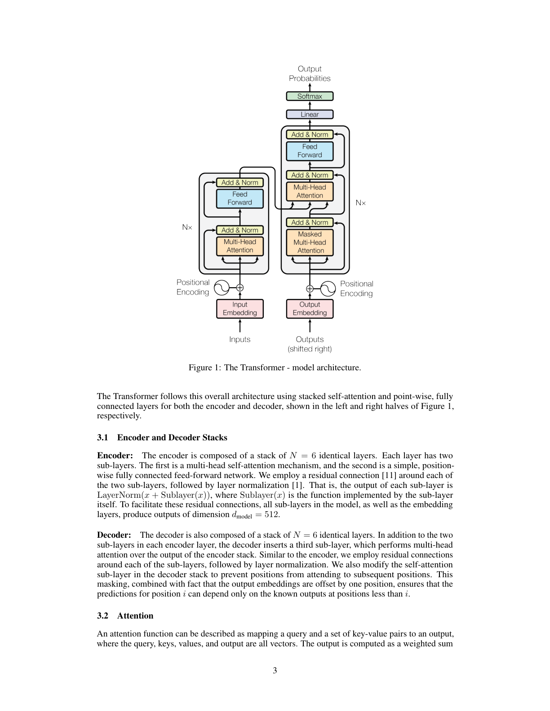
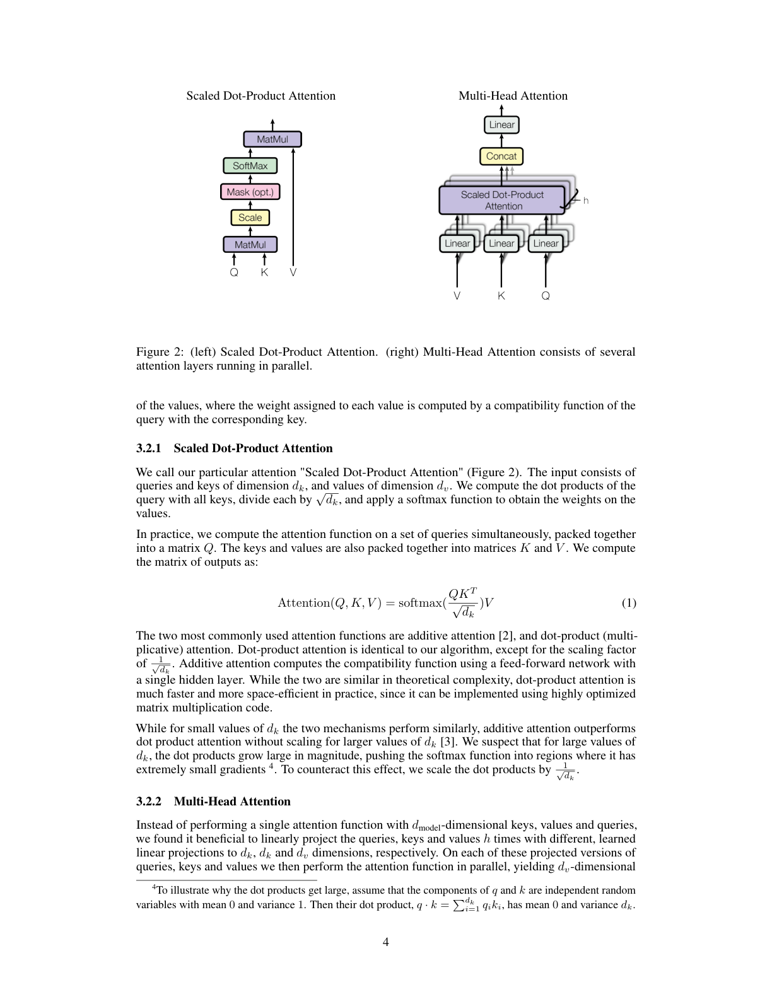
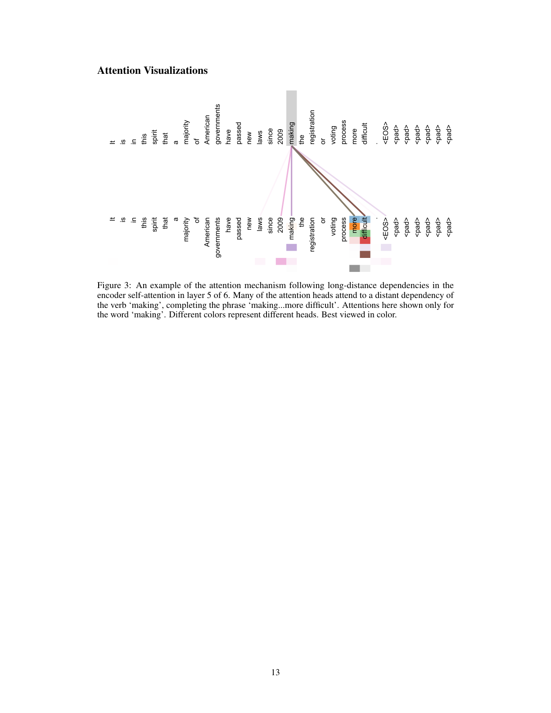
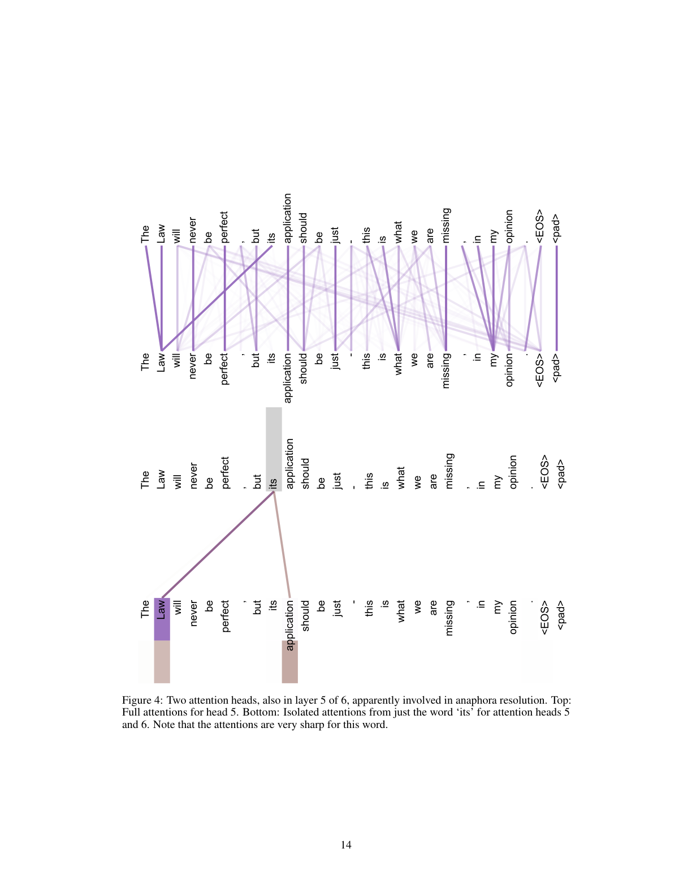
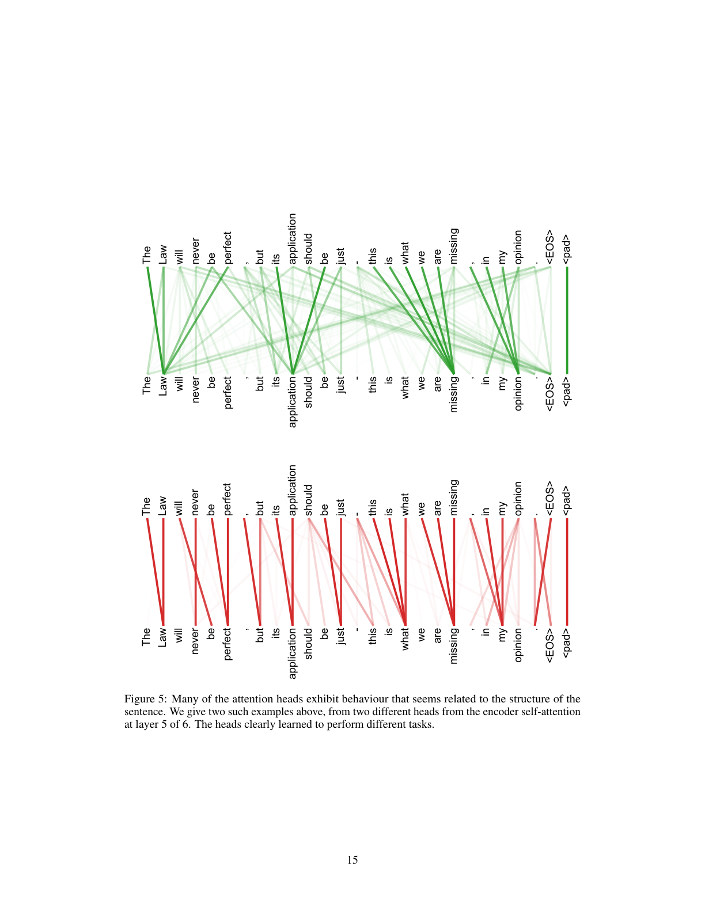

# 注意力就是你所需要的一切

> 原文：Attention Is All You Need
> 作者：Ashish Vaswani, Noam Shazeer, Niki Parmar, Jakob Uszkoreit, Llion Jones, Aidan N. Gomez, Łukasz Kaiser, Illia Polosukhin
> 发表：NeurIPS 2017（arXiv:1706.03762）
> 说明：本文档为全文中译。公式、图表编号与原文一致；图见对应页截图 `figures/page_N.png`，[英文原文 PDF](attention_is_all_you_need.pdf)。

---

## 摘要

主流的序列转导模型基于复杂的循环或卷积神经网络，包含一个编码器和一个解码器。表现最好的模型还通过注意力机制连接编码器和解码器。我们提出一种新的简单网络架构——Transformer，它完全基于注意力机制，彻底摒弃了循环和卷积。在两个机器翻译任务上的实验表明，这些模型在质量上更优，同时更可并行化，所需的训练时间也显著更少。我们的模型在 WMT 2014 英德翻译任务上取得 28.4 BLEU，比现有最佳结果（包括集成）提升了 2 个 BLEU 以上。在 WMT 2014 英法翻译任务上，我们的模型在 8 块 GPU 上训练 3.5 天后，建立了 41.8 BLEU 的新单模型最先进水平——这只是文献中最佳模型训练成本的一小部分。我们还通过将 Transformer 成功应用于大数据量和小数据量的英语成分句法分析，表明它能很好地泛化到其他任务。

> ∗ 同等贡献。排名顺序随机。Jakob 提出用自注意力替代 RNN 并开始评估这一想法；Ashish 与 Illia 设计并实现了第一个 Transformer 模型；Noam 提出缩放点积注意力、多头注意力和无参数位置表示；Niki 设计、实现、调参并评估了无数模型变体；Llion 负责初始代码库与高效推理和可视化；Lukasz 和 Aidan 设计并实现了 tensor2tensor。

---

## 1. 引言

循环神经网络，特别是长短期记忆（LSTM）[13] 和门控循环（GRU）[7] 神经网络，已被牢固确立为序列建模和转导问题（如语言建模和机器翻译 [35, 2, 5]）的最先进方法。此后大量工作持续推动循环语言模型和编码器-解码器架构的边界 [38, 24, 15]。

循环模型通常沿输入和输出序列的符号位置分解计算。将位置与计算时间步对齐，它们生成一个隐藏状态序列 h_t，作为前一个隐藏状态 h_{t−1} 和位置 t 输入的函数。这种固有的顺序性质阻碍了训练样本内的并行化，而在较长序列长度时这一点变得至关重要，因为内存限制约束了跨样本的批处理。近期工作通过分解技巧 [21] 和条件计算 [32] 在计算效率上取得了显著改进，后者还提升了模型性能。然而，顺序计算的根本约束依然存在。

注意力机制已成为各种任务中引人注目的序列建模和转导模型不可或缺的一部分，它允许对依赖关系建模而不考虑其在输入或输出序列中的距离 [2, 19]。然而，除少数情况 [27] 外，这种注意力机制都与循环网络结合使用。

在这项工作中，我们提出 Transformer——一种摒弃循环、转而完全依赖注意力机制来捕捉输入与输出之间全局依赖的模型架构。Transformer 允许显著更多的并行化，并且只需在 8 块 P100 GPU 上训练短短十二小时，就能在翻译质量上达到新的最先进水平。

---

## 2. 背景

减少顺序计算的目标也是 Extended Neural GPU [16]、ByteNet [18] 和 ConvS2S [9] 的基础，它们都使用卷积神经网络作为基本构建块，对所有输入和输出位置并行计算隐藏表示。在这些模型中，关联来自两个任意输入或输出位置的信号所需的操作数随位置间距离增长——ConvS2S 是线性增长，ByteNet 是对数增长。这使得学习远距离位置之间的依赖更加困难 [12]。在 Transformer 中，这被减少为常数次操作，尽管代价是由于对注意力加权位置取平均而降低了有效分辨率——我们用 3.2 节所述的多头注意力来抵消这一影响。

自注意力（Self-attention），有时称为内部注意力（intra-attention），是一种将单个序列的不同位置关联起来以计算该序列表示的注意力机制。自注意力已成功用于多种任务，包括阅读理解、抽象摘要、文本蕴含和学习与任务无关的句子表示 [4, 27, 28, 22]。

端到端记忆网络基于循环注意力机制而非序列对齐的循环，已被证明在简单语言问答和语言建模任务上表现良好 [34]。

然而，据我们所知，Transformer 是第一个完全依赖自注意力来计算其输入和输出表示、而不使用序列对齐的 RNN 或卷积的转导模型。在以下各节中，我们将描述 Transformer，论证自注意力的动机，并讨论它相对于 [17, 18] 和 [9] 等模型的优势。

---

## 3. 模型架构

大多数有竞争力的神经序列转导模型都有编码器-解码器结构 [5, 2, 35]。这里，编码器将符号表示的输入序列 (x₁, ..., xₙ) 映射到连续表示序列 z = (z₁, ..., zₙ)。给定 z，解码器随后逐元素生成符号的输出序列 (y₁, ..., yₘ)。在每一步，模型是自回归的 [10]，在生成下一个符号时将先前生成的符号作为额外输入。



> **图 1.** Transformer —— 模型架构。

Transformer 遵循这一总体架构，对编码器和解码器都使用堆叠的自注意力和逐点的全连接层，分别如图 1 的左半部分和右半部分所示。

### 3.1 编码器与解码器堆叠

**编码器：** 编码器由 N = 6 个相同层的堆叠组成。每层有两个子层。第一个是多头自注意力机制，第二个是简单的逐点全连接前馈网络。我们在两个子层各自周围使用残差连接 [11]，随后接层归一化 [1]。也就是说，每个子层的输出是 LayerNorm(x + Sublayer(x))，其中 Sublayer(x) 是子层本身实现的函数。为便于这些残差连接，模型中的所有子层以及嵌入层都产生维度为 d_model = 512 的输出。

**解码器：** 解码器同样由 N = 6 个相同层的堆叠组成。除了每个编码器层中的两个子层外，解码器插入第三个子层，它对编码器堆叠的输出执行多头注意力。与编码器类似，我们在每个子层周围使用残差连接，随后接层归一化。我们还修改解码器堆叠中的自注意力子层，以阻止位置关注其后的位置。这种掩码，结合输出嵌入偏移一个位置的事实，确保了对位置 i 的预测只能依赖于位置小于 i 的已知输出。

### 3.2 注意力

注意力函数可描述为将一个查询（query）和一组键值（key-value）对映射到一个输出，其中查询、键、值和输出都是向量。输出计算为值的加权和，其中分配给每个值的权重由查询与对应键的兼容性函数计算。



> **图 2.**（左）缩放点积注意力。（右）多头注意力由多个并行运行的注意力层组成。

#### 3.2.1 缩放点积注意力

我们将我们的特定注意力称为"缩放点积注意力"（图 2）。输入由维度为 d_k 的查询和键、以及维度为 d_v 的值组成。我们计算查询与所有键的点积，每个除以 √d_k，然后应用 softmax 函数得到值的权重。

实践中，我们将注意力函数同时作用于打包成矩阵 Q 的一组查询。键和值也打包成矩阵 K 和 V。我们计算输出矩阵为：

```
Attention(Q, K, V) = softmax(QKᵀ / √d_k) V        (1)
```

两种最常用的注意力函数是加性注意力 [2] 和点积（乘性）注意力。点积注意力与我们的算法相同，除了缩放因子 1/√d_k。加性注意力用带单个隐藏层的前馈网络计算兼容性函数。虽然两者在理论复杂度上相近，但点积注意力在实践中快得多、空间效率更高，因为它可以用高度优化的矩阵乘法代码实现。

当 d_k 较小时，两种机制表现相近；但当 d_k 较大时，加性注意力优于不带缩放的点积注意力 [3]。我们推测，对较大的 d_k，点积的量级变大，将 softmax 函数推入梯度极小的区域⁴。为抵消这一影响，我们将点积缩放 1/√d_k。

> ⁴ 为说明点积为何变大，假设 q 和 k 的分量是均值 0、方差 1 的独立随机变量。那么它们的点积 q·k = Σ_{i=1}^{d_k} q_i·k_i 的均值为 0、方差为 d_k。

#### 3.2.2 多头注意力

我们发现，与其用 d_model 维的键、值和查询执行单个注意力函数，不如将查询、键和值分别用不同的、学习到的线性投影投影 h 次到 d_k、d_k 和 d_v 维。然后我们在这些投影后的查询、键和值上并行执行注意力函数，得到 d_v 维的输出值。这些被拼接起来并再次投影，得到最终值，如图 2 所示。

多头注意力使模型能在不同位置共同关注来自不同表示子空间的信息。单个注意力头时，取平均会抑制这一点。

```
MultiHead(Q, K, V) = Concat(head₁, ..., head_h) Wᴼ
其中 head_i = Attention(QW_i^Q, KW_i^K, VW_i^V)
```

其中投影是参数矩阵 W_i^Q ∈ R^{d_model×d_k}，W_i^K ∈ R^{d_model×d_k}，W_i^V ∈ R^{d_model×d_v}，Wᴼ ∈ R^{hd_v×d_model}。

在这项工作中我们使用 h = 8 个并行注意力层（头）。对每个头我们使用 d_k = d_v = d_model/h = 64。由于每个头的维度降低，总计算成本与全维度的单头注意力相近。

#### 3.2.3 注意力在我们模型中的应用

Transformer 以三种不同方式使用多头注意力：

- **在"编码器-解码器注意力"层中**，查询来自前一个解码器层，记忆键和值来自编码器的输出。这使解码器中的每个位置都能关注输入序列中的所有位置。这模仿了序列到序列模型（如 [38, 2, 9]）中典型的编码器-解码器注意力机制。

- **编码器包含自注意力层**。在自注意力层中，所有键、值和查询来自同一处——这里是编码器中前一层的输出。编码器中的每个位置都能关注编码器前一层的所有位置。

- **类似地，解码器中的自注意力层**允许解码器中的每个位置关注解码器中直到并包括该位置的所有位置。我们需要阻止解码器中的左向信息流以保持自回归性质。我们通过在缩放点积注意力内部将 softmax 输入中对应非法连接的所有值屏蔽（设为 −∞）来实现这一点。见图 2。

### 3.3 逐点前馈网络

除了注意力子层外，我们编码器和解码器中的每一层还包含一个全连接前馈网络，它对每个位置分别且相同地应用。它由两个线性变换和中间的一个 ReLU 激活组成。

```
FFN(x) = max(0, xW₁ + b₁)W₂ + b₂        (2)
```

虽然线性变换在不同位置是相同的，但它们在不同层之间使用不同的参数。另一种描述方式是两个核大小为 1 的卷积。输入和输出的维度为 d_model = 512，内层维度为 d_ff = 2048。

### 3.4 嵌入与 Softmax

与其他序列转导模型类似，我们使用学习到的嵌入将输入 token 和输出 token 转换为 d_model 维向量。我们还使用通常的学习到的线性变换和 softmax 函数将解码器输出转换为预测的下一 token 概率。在我们的模型中，我们在两个嵌入层和 pre-softmax 线性变换之间共享相同的权重矩阵，类似于 [30]。在嵌入层中，我们将这些权重乘以 √d_model。

### 3.5 位置编码

由于我们的模型不包含循环和卷积，为了让模型利用序列的顺序，我们必须注入一些关于 token 在序列中相对或绝对位置的信息。为此，我们在编码器和解码器堆叠底部的输入嵌入上添加"位置编码"。位置编码与嵌入有相同的维度 d_model，因此两者可以相加。位置编码有许多选择，包括学习的和固定的 [9]。

在这项工作中，我们使用不同频率的正弦和余弦函数：

```
PE(pos, 2i)   = sin(pos / 10000^(2i/d_model))
PE(pos, 2i+1) = cos(pos / 10000^(2i/d_model))
```

其中 pos 是位置，i 是维度。也就是说，位置编码的每个维度对应一个正弦曲线。波长形成从 2π 到 10000·2π 的等比数列。我们选择这个函数是因为我们假设它能让模型容易学习按相对位置进行关注，因为对任何固定偏移 k，PE_{pos+k} 都可表示为 PE_pos 的线性函数。

我们还实验了使用学习的位置嵌入 [9] 作为替代，发现两个版本产生几乎相同的结果（见表 3 第 (E) 行）。我们选择正弦版本是因为它可能允许模型外推到比训练时遇到的更长的序列长度。

---

## 4. 为什么用自注意力

本节我们将自注意力层的各个方面与通常用于将一个变长符号表示序列 (x₁, ..., xₙ) 映射到等长另一序列 (z₁, ..., zₙ)（其中 x_i, z_i ∈ R^d，如典型序列转导编码器或解码器中的隐藏层）的循环和卷积层进行比较。促使我们使用自注意力，我们考虑三个期望目标。

其一是每层的总计算复杂度。其二是可并行化的计算量，用所需的最少顺序操作数衡量。

其三是网络中长程依赖之间的路径长度。学习长程依赖是许多序列转导任务的关键挑战。影响学习此类依赖能力的一个关键因素是前向和后向信号在网络中必须穿越的路径长度。输入和输出序列中任意位置组合之间的这些路径越短，学习长程依赖就越容易 [12]。因此我们还比较了由不同层类型组成的网络中任意两个输入和输出位置之间的最大路径长度。

**表 1.** 不同层类型的最大路径长度、每层复杂度和最少顺序操作数。n 是序列长度，d 是表示维度，k 是卷积核大小，r 是受限自注意力中的邻域大小。

| 层类型 | 每层复杂度 | 顺序操作数 | 最大路径长度 |
|---|---|---|---|
| 自注意力 | O(n²·d) | O(1) | O(1) |
| 循环 | O(n·d²) | O(n) | O(n) |
| 卷积 | O(k·n·d²) | O(1) | O(log_k(n)) |
| 自注意力（受限） | O(r·n·d) | O(1) | O(n/r) |

如表 1 所示，自注意力层用常数次顺序执行的操作连接所有位置，而循环层需要 O(n) 次顺序操作。在计算复杂度方面，当序列长度 n 小于表示维度 d 时，自注意力层比循环层更快——这正是机器翻译中最先进模型所用句子表示的常见情形，如 word-piece [38] 和 byte-pair [31] 表示。为改进涉及非常长序列任务的计算性能，自注意力可受限为只考虑输入序列中以相应输出位置为中心、大小为 r 的邻域。这会将最大路径长度增加到 O(n/r)。我们计划在未来工作中进一步研究这种方法。

核宽度 k < n 的单个卷积层不会连接所有输入和输出位置对。要做到这一点，连续核情形需要堆叠 O(n/k) 个卷积层，扩张卷积情形需要 O(log_k(n)) [18]，这增加了网络中任意两个位置之间最长路径的长度。卷积层通常比循环层贵 k 倍。然而可分离卷积 [6] 将复杂度大幅降低至 O(k·n·d + n·d²)。但即使 k = n，可分离卷积的复杂度也等于自注意力层与逐点前馈层的组合——这正是我们模型采用的方法。

作为附带好处，自注意力可以产生更可解释的模型。我们检查了我们模型的注意力分布，并在附录中给出和讨论了一些例子。不仅单个注意力头清楚地学会了执行不同的任务，许多头似乎还表现出与句子句法和语义结构相关的行为。

---

## 5. 训练

本节描述我们模型的训练机制。

### 5.1 训练数据与批处理

我们在标准的 WMT 2014 英德数据集上训练，该数据集包含约 450 万个句对。句子用 byte-pair 编码 [3] 编码，源-目标共享约 37000 个 token 的词表。对英法，我们使用大得多的 WMT 2014 英法数据集，包含 3600 万句子，并将 token 拆分为 32000 的 word-piece 词表 [38]。句对按近似序列长度分批。每个训练批次包含一组句对，约含 25000 个源 token 和 25000 个目标 token。

### 5.2 硬件与调度

我们在一台配 8 块 NVIDIA P100 GPU 的机器上训练模型。对使用全文所述超参数的 base 模型，每个训练步约 0.4 秒。我们训练 base 模型共 100,000 步（12 小时）。对 big 模型（见表 3 最后一行），每步 1.0 秒。big 模型训练了 300,000 步（3.5 天）。

### 5.3 优化器

我们使用 Adam 优化器 [20]，β₁ = 0.9，β₂ = 0.98，ε = 10⁻⁹。我们在训练过程中按以下公式变化学习率：

```
lrate = d_model^(−0.5) · min(step_num^(−0.5), step_num · warmup_steps^(−1.5))    (3)
```

这对应于在前 warmup_steps 个训练步内线性地增大学习率，此后按步数的逆平方根成比例地减小。我们使用 warmup_steps = 4000。

### 5.4 正则化

我们在训练中使用三种正则化：

**残差 Dropout。** 我们对每个子层的输出应用 dropout [33]，在它被加到子层输入并归一化之前。此外，我们对编码器和解码器堆叠中嵌入与位置编码之和也应用 dropout。对 base 模型，我们使用 P_drop = 0.1 的比率。

**标签平滑。** 训练期间，我们采用 ε_ls = 0.1 的标签平滑 [36]。这会损害困惑度，因为模型学会了更不确定，但能提高精度和 BLEU 分数。

---

## 6. 结果

### 6.1 机器翻译

在 WMT 2014 英德翻译任务上，big transformer 模型（表 2 中的 Transformer (big)）比以往报告的最佳模型（包括集成）高出 2.0 BLEU 以上，建立了 28.4 BLEU 的新最先进水平。该模型的配置列于表 3 最后一行。训练在 8 块 P100 GPU 上用了 3.5 天。甚至我们的 base 模型也超过了以往所有已发表的模型和集成，且训练成本只是任何有竞争力模型的一小部分。

在 WMT 2014 英法翻译任务上，我们的 big 模型取得 41.0 BLEU，优于以往所有已发表的单模型，且训练成本不到以往最先进模型的 1/4。用于英法训练的 Transformer (big) 模型使用 dropout 比率 P_drop = 0.1，而非 0.3。

对 base 模型，我们使用通过对最后 5 个检查点取平均得到的单模型，检查点以 10 分钟间隔写出。对 big 模型，我们对最后 20 个检查点取平均。我们使用束大小为 4、长度惩罚 α = 0.6 的束搜索 [38]。这些超参数是在开发集上实验后选定的。我们将推理期间的最大输出长度设为输入长度 + 50，但尽可能提前终止 [38]。

**表 2.** Transformer 在英德和英法 newstest2014 测试上以训练成本的一小部分取得了比以往最先进模型更好的 BLEU 分数。

表 2 总结了我们的结果，并将我们的翻译质量和训练成本与文献中的其他模型架构进行比较。我们通过将训练时间、所用 GPU 数量和每块 GPU 持续单精度浮点能力的估计值相乘，来估计训练模型所用的浮点运算次数⁵。

> ⁵ 我们对 K80、K40、M40 和 P100 分别使用 2.8、3.7、6.0 和 9.5 TFLOPS 的数值。

### 6.2 模型变体

为评估 Transformer 不同组件的重要性，我们以不同方式改变 base 模型，测量英德翻译在开发集 newstest2013 上的性能变化。我们使用上一节所述的束搜索，但不做检查点平均。我们将这些结果呈现在表 3 中。

**表 3.** Transformer 架构的变体。未列出的值与 base 模型相同。所有指标都在英德翻译开发集 newstest2013 上。所列困惑度是按我们 byte-pair 编码的每 wordpiece，不应与每词困惑度比较。

在表 3 第 (A) 行，我们改变注意力头数以及注意力键和值维度，同时保持计算量不变（如 3.2.2 节所述）。虽然单头注意力比最佳设置差 0.9 BLEU，但头数过多时质量也会下降。

在表 3 第 (B) 行，我们观察到减小注意力键大小 d_k 会损害模型质量。这表明确定兼容性并不容易，比点积更复杂的兼容性函数可能有益。我们在第 (C) 和 (D) 行进一步观察到，如预期，更大的模型更好，dropout 对避免过拟合非常有帮助。在第 (E) 行，我们用学习的位置嵌入 [9] 替换正弦位置编码，观察到与 base 模型几乎相同的结果。

### 6.3 英语成分句法分析

为评估 Transformer 是否能泛化到其他任务，我们在英语成分句法分析上做了实验。这个任务提出特定挑战：输出受强结构约束，且明显长于输入。此外，RNN 序列到序列模型在小数据情形下一直无法达到最先进结果 [37]。

我们在 Penn Treebank [25] 的 Wall Street Journal（WSJ）部分（约 40K 训练句子）上训练了 d_model = 1024 的 4 层 transformer。我们还在半监督设定下训练它，使用更大的高置信度和 BerkleyParser 语料库（约 1700 万句子）[37]。我们对仅 WSJ 设定使用 16K token 词表，对半监督设定使用 32K token 词表。

我们只做了少量实验来选择 dropout（注意力和残差，见 5.4 节）、学习率和束大小（在 Section 22 开发集上），所有其他参数保持与英德 base 翻译模型不变。推理期间，我们将最大输出长度增加到输入长度 + 300。对仅 WSJ 和半监督设定，我们都使用束大小 21 和 α = 0.3。

**表 4.** Transformer 能很好地泛化到英语成分句法分析（结果在 WSJ 的 Section 23 上）。

我们在表 4 中的结果表明，尽管缺乏针对任务的调优，我们的模型表现出人意料地好，产生了比以往所有报告模型更好的结果，除了循环神经网络文法（Recurrent Neural Network Grammar）[8]。

与 RNN 序列到序列模型 [37] 相比，即使只在 40K 句子的 WSJ 训练集上训练，Transformer 也优于 BerkeleyParser [29]。

---

## 7. 结论

在这项工作中，我们提出了 Transformer——第一个完全基于注意力的序列转导模型，用多头自注意力替代了编码器-解码器架构中最常用的循环层。

对翻译任务，Transformer 比基于循环或卷积层的架构训练快得多。在 WMT 2014 英德和 WMT 2014 英法翻译任务上，我们都达到了新的最先进水平。在前一个任务上，我们的最佳模型甚至超过了以往所有报告的集成。

我们对基于注意力的模型的未来感到兴奋，并计划将它们应用于其他任务。我们计划将 Transformer 扩展到涉及文本以外输入和输出模态的问题，并研究局部、受限的注意力机制，以高效处理图像、音频和视频等大型输入和输出。让生成更少顺序化是我们的另一个研究目标。

我们用于训练和评估模型的代码见 https://github.com/tensorflow/tensor2tensor。

**致谢：** 感谢 Nal Kalchbrenner 和 Stephan Gouws 富有成效的评论、修正和启发。

---

## 附录：注意力可视化



> **图 3.** 编码器自注意力第 5 层（共 6 层）中，注意力机制追踪长距离依赖的例子。许多注意力头关注动词 "making" 的远距离依赖，完成短语 "making...more difficult"。这里只显示单词 "making" 的注意力。不同颜色代表不同的头。彩色查看效果更佳。



> **图 4.** 两个注意力头，也在第 5 层（共 6 层），显然参与了指代消解（anaphora resolution）。上：头 5 的完整注意力。下：仅单词 "its" 对头 5 和头 6 的孤立注意力。注意对这个词注意力非常尖锐。



> **图 5.** 许多注意力头表现出似乎与句子结构相关的行为。上面给出两个这样的例子，来自编码器自注意力第 5 层（共 6 层）的两个不同头。这些头清楚地学会了执行不同的任务。

---

## 参考文献

（保留原文编号 [1]–[40]，均为英文文献，此处从略。完整列表见原文 PDF 第 10–12 页。）
