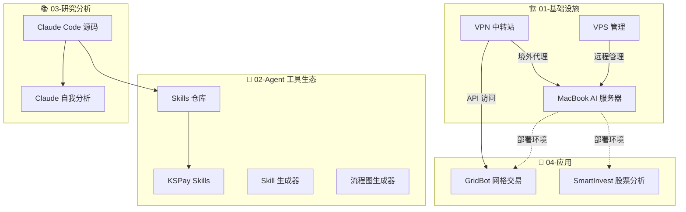

# 🧠 AI 工作区

> 可累积的知识体系——每个项目都是一级阶梯，后面的项目站在前面的肩膀上。

---

## 🪜 知识阶梯



### 阅读顺序

| # | 项目 | 掌握能力 | 为什么是基础 |
|---|------|---------|------------|
| 1 | VPN 中转站 | 境外 IP 访问 | 后续所有需要访问境外 API/网站的项目都依赖它 |
| 2 | VPS 管理 | SSH 远程操作 | 理解远程服务器管理的基本范式 |
| 3 | MacBook 服务器 | 本地 AI 服务器 | 把家里的闲置 Mac 变成 7×24 运行的 AI 终端 |
| 4 | Claude Code 源码 | Agent 架构理解 | 深入理解 AI Agent 的工作方式 |
| 5 | Claude 自我分析 | 架构分析能力 | 学会系统性地分析大型 Agent 项目 |
| 6 | Skills 仓库 | Agent Skill 机制 | 理解如何扩展 AI Agent 的能力 |
| 7 | Skill 生成器 | 自动化知识积累 | 自动爬取 + AI 生成技能文档 |
| 8 | 流程图生成器 | 可视化设计 | 用 AI 生成 draw.io 流程图 |
| 9 | GridBot | 自动化交易 | AI 驱动的量化交易机器人 |
| 10 | SmartInvest | AI 投研 | AI 股票深度分析 |

---

## 📂 目录结构

```
ai/
├── README.md                          ← 你在这里
├── 01-infrastructure/                 🏗️ 基础设施
│   ├── vpn-relay/                    VPN 中转站部署手册
│   ├── vps-quick-access/            VPS 快速访问手册
│   └── macbook-server/              MacBook → AI 服务器（交互式 HTML 指南）
├── 02-agent-tools/                    🧠 Agent 工具生态
│   ├── skills-repo/                 CodeFlicker Agent Skills 仓库
│   ├── kspay-skills/                KSPay 支付系统专用 Skills
│   ├── skill-generator/             技能爬虫 + AI 文档生成器
│   └── drawio-generator/            AI 流程图生成器
├── 03-research/                       📚 研究 & 分析
│   ├── claude-code-source/          Claude Code v2.1.88 逆向源码
│   └── claude-code-analysis/        Claude 自读源码分析
└── 04-applications/                   🚀 最终应用
    ├── gridbot/                     加密货币网格交易机器人
    └── smart-invest/                AI 股票分析应用
```

---

## 🏗️ 01-基础设施

### VPN 中转站
**能力提供**：境外 IP 代理访问

- 📄 手册：[VPN中转站完整部署手册.html](01-infrastructure/vpn-relay/VPN中转站完整部署手册.html)
- 📄 手册：[ColoCrossing翻墙节点部署手册.html](01-infrastructure/vpn-relay/ColoCrossing翻墙节点部署手册.html)
- 🔗 被依赖：MacBook 服务器（安装境外工具）、GridBot（访问境外交易所 API）

### VPS 快速访问
**能力提供**：SSH 远程管理范式

- 📄 手册：[VPS快速访问手册.html](01-infrastructure/vps-quick-access/VPS快速访问手册.html)
- 🔗 被依赖：所有远程服务器管理

### MacBook AI 服务器
**能力提供**：7×24 本地 AI 运行环境

- 📄 指南：[macbook-ai-server-guide.html](01-infrastructure/macbook-server/macbook-ai-server-guide.html)
- 🛠️ 技术栈：macOS + Cloudflare Tunnel + SSH + caffeinate + launchd
- 🤖 AI 工具：CodeWhale (DeepSeek V4) → Claude Code → Codex CLI
- 🧱 依赖基础：VPN 中转站（境外访问）、VPS 管理经验（远程 SSH）

---

## 🧠 02-Agent 工具生态

### Skills 仓库
**能力提供**：可复用的 AI Agent Skill 定义

- 📂 目录：[skills-repo/](02-agent-tools/skills-repo/)
- 7 个 Skills：duet3-log-analyzer、tech-doc-organizer、commit-msg、test-case-generate、animal-speak、skill-manager

### KSPay Skills
**能力提供**：支付系统专用开发流程

- 📂 目录：[kspay-skills/](02-agent-tools/kspay-skills/)
- Spec-Coding 工作流：需求 → 方案 → 实现 → 测试

### Skill 生成器
**能力提供**：自动爬取 + AI 生成技能文档

- 📂 目录：[skill-generator/](02-agent-tools/skill-generator/)
- 🛠️ 技术栈：Python FastAPI + Vue 3 + Naive UI + SQLite
- 6 大信源：GitHub Trending / Hacker News / Dev.to / Product Hunt / SkillHub

### 流程图生成器
**能力提供**：自然语言 → draw.io 流程图

- 📂 目录：[drawio-generator/](02-agent-tools/drawio-generator/)
- 🛠️ 技术栈：TypeScript CLI + BFS 自动布局

---

## 📚 03-研究分析

### Claude Code 源码
**能力提供**：Agent 架构深度理解

- 📂 目录：[claude-code-source/](03-research/claude-code-source/)
- 规模：~512K 行 TypeScript，1,884 文件
- 核心：QueryEngine.ts (1296行) + 42+ 工具 + React+Ink 终端 UI

### Claude 自我分析
**能力提供**：系统性架构分析能力

- 📂 目录：[claude-code-analysis/](03-research/claude-code-analysis/)
- 7 篇架构分析（中英双语）：QueryEngine / Tool / Coordinator / Plugin / Hook / Bash / Permission

---

## 🚀 04-应用

### GridBot — 网格交易机器人
**能力提供**：AI 驱动的自动化交易

- 📂 目录：[gridbot/](04-applications/gridbot/)
- 🛠️ 技术栈：Python + FastAPI + CCXT + SQLModel + Docker
- 🧱 依赖基础：VPN 中转站（访问 OKX API）

### SmartInvest — AI 股票分析
**能力提供**：AI 深度投研报告

- 📂 目录：[smart-invest/](04-applications/smart-invest/)
- 🛠️ 技术栈：React 19 + TypeScript + Vite + Gemini

---

## 🔑 核心原则

1. **累积而非重复**：每个项目输出可被下一个项目使用的能力
2. **基础设施先行**：VPN → VPS → 本地服务器，逐级搭建
3. **文档即代码**：部署手册放在对应项目目录下，一步到位
4. **AI 可读**：目录结构清晰、文件名语义化，AI Agent 能理解上下文
