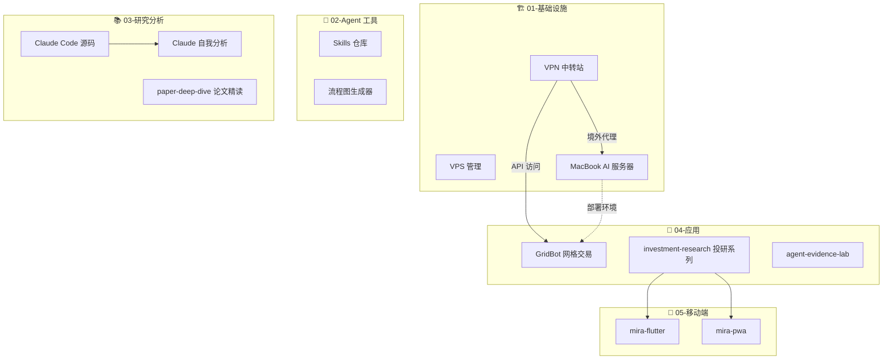

# 🧠 AI 工作区

> 可累积的知识体系——每个项目都是一级阶梯，后面的项目站在前面的肩膀上。

远程仓库：`github.com/momo0205/ai-instructure`（私有 monorepo，主分支 `main`）

---

## 📂 目录结构（实际现状）

```
ai-instructure/
├── README.md                        ← 你在这里
├── AGENTS.md                        ← Superpowers 方法论 + Mem0 跨 Agent 记忆 SOP
├── MIRA-MEMORY.md                   ← Mira 项目踩坑记录（CodeWhale 会话）
├── .memory/                         ← Mem0 记忆系统（config.py / mem.py，数据不入库）
│
├── 01-infrastructure/               🏗️ 基础设施手册（HTML）
│   ├── vpn-relay/                   VPN 中转站部署手册 ×2
│   ├── vps-quick-access/            VPS 快速访问手册
│   └── macbook-server/              MacBook → AI 服务器指南
│
├── 02-agent-tools/                  🧠 Agent 工具生态
│   ├── skills-repo/                 Agent Skills 仓库（fun-tools / git-tools / spec-helper 三个插件）
│   └── drawio-generator/            自然语言 → draw.io 流程图（TypeScript CLI + BFS 布局）
│
├── 03-research/                     📚 研究 & 分析
│   ├── claude-code-source/          [子模块] Claude Code 逆向源码（~512K 行 TS）
│   ├── claude-code-analysis/        Claude 自读源码分析（7 篇架构文档，中英双语）
│   ├── jev-decision-lab/            JEV 决策实验室（docs/）
│   └── paper-deep-dive/             三篇经典论文精读工作台（ResNet / Transformer / DDPM）
│
├── 04-applications/                 🚀 应用
│   ├── gridbot/                     加密货币网格交易机器人（Python + FastAPI + CCXT + Docker）
│   ├── agent-evidence-lab/          Agent 证据实验室（Java/Maven + Python workers，可审计闭环）
│   └── investment-research/         💰 投研系列
│       ├── Mira/                    [子模块] 投研协议（byteseek/Mira）
│       ├── a-stock-data/            [子模块] A 股数据工具包（simonlin1212/a-stock-data）
│       ├── a-stock-strategy/        A 股日线策略回测（见 MVP.md，pyproject + uv）
│       ├── mira-server/             Mira HTTP API 服务端（Python）
│       └── deploy-guide.html        部署指南
│
├── 05-mobile/                       📱 移动端（Mira 客户端系列）
│   ├── mira-flutter/                [子模块] Flutter App（momo0205/mira-flutter）
│   ├── mira-client/                 原生 Android 客户端（Gradle/Kotlin）
│   ├── mira-pwa/                    PWA 版本（含 APK 打包）
│   ├── apk-project/                 APK 构建工程
│   └── *.apk                        各版本安装包
│
├── docs/superpowers/                📝 设计文档与实施计划
│   ├── specs/                       5 份设计文档（mira-flutter / notes-site / a-stock / breadth-mvp / paper-deep-dive）
│   └── plans/                       5 份对应实施计划
│
└── superpowers/                     [子模块] Superpowers 技能框架（momo0205/superpowers fork）
                                     含 14 个技能：brainstorming / TDD / systematic-debugging / ...
```

---

## 🔗 子模块清单（6 个）

克隆本仓库后需要 `git submodule update --init` 才能拉取：

| 路径 | 来源 |
|---|---|
| `04-applications/investment-research/Mira` | github.com/byteseek/Mira |
| `04-applications/investment-research/a-stock-data` | github.com/simonlin1212/a-stock-data |
| `05-mobile/mira-flutter` | github.com/momo0205/mira-flutter |
| `03-research/claude-code-source` | github.com/momo0205/claude-code-source-code |
| `03-research/claude-code-analysis/claude-reviews-claude` | github.com/momo0205/claude-reviews-claude |
| `superpowers` | github.com/momo0205/superpowers |

---

## 🪜 项目之间的依赖关系


```mermaid
graph TD
    subgraph L0["🏗️ 01-基础设施"]
        vpn["VPN 中转站"]
        vps["VPS 管理"]
        macbook["MacBook AI 服务器"]
    end

    subgraph L1["🧠 02-Agent 工具"]
        skills["Skills 仓库"]
        drawio["流程图生成器"]
    end

    subgraph L2["📚 03-研究分析"]
        cc_src["Claude Code 源码"]
        cc_ana["Claude 自我分析"]
        papers["paper-deep-dive 论文精读"]
    end

    subgraph L3["🚀 04-应用"]
        gridbot["GridBot 网格交易"]
        mira["investment-research 投研系列"]
        ael["agent-evidence-lab"]
    end

    subgraph L4["📱 05-移动端"]
        flutter["mira-flutter"]
        pwa["mira-pwa"]
    end

    vpn -->|境外代理| macbook
    vpn -->|API 访问| gridbot
    cc_src --> cc_ana
    macbook -.->|部署环境| gridbot
    mira --> flutter
    mira --> pwa
```

---

## 🔑 核心原则

1. **累积而非重复**：每个项目输出可被下一个项目使用的能力
2. **基础设施先行**：VPN → VPS → 本地服务器，逐级搭建
3. **文档即代码**：部署手册放在对应项目目录下，一步到位
4. **AI 可读**：目录结构清晰、文件名语义化，AI Agent 能理解上下文
5. **子项目独立**：每个子项目有自己的构建/测试体系；部分是独立 git 子模块

---

## 📌 当前活跃项目

| 项目 | 状态 | 入口 |
|---|---|---|
| paper-deep-dive | 🔵 进行中（ResNet 第 1 周） | `03-research/paper-deep-dive/index.html` |
| a-stock-strategy | 🔵 进行中（分支 codex/a-stock-breadth-mvp） | `04-applications/investment-research/a-stock-strategy/MVP.md` |
| Mira 投研 | 🟡 维护中 | `04-applications/investment-research/Mira/START_HERE.md` |
